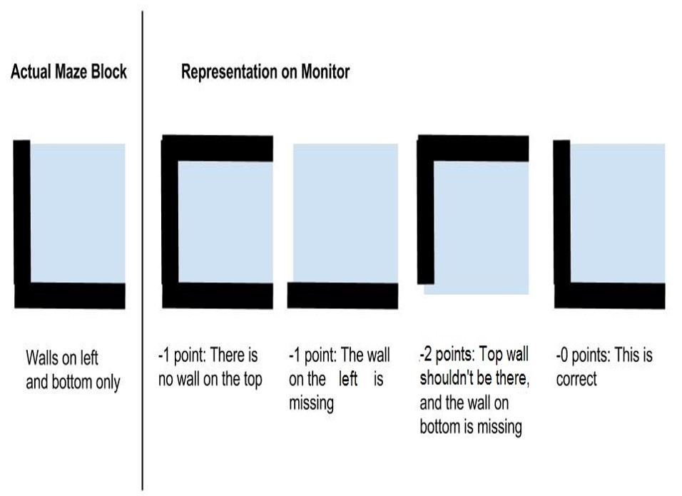

# ECE 3400, Fall 2017 - Final Competition

## Competition Overview

The maze layout will be changed between rounds, but remain the same within a round. These layouts will not be revealed before the competition, and teams are not allowed to change their algorithms between rounds. 

The competition will have a total of four rounds: 

* Round 1a: Team 1 + Team 2 + Team 3 + Team 4 + Team 5 + Team 6
* Round 1b: Team 7 + Team 8 + Team 9 + Team 10 + Team 11 + Team 12
* Round 1c: Team 13 + Team 14 + Team 15 + Team 16 + Team 17
* Round 2a: Team 1 + Team 2 + Team 3 + Team 4 + Team 5 + Team 6
* Round 2b: Team 7 + Team 8 + Team 9 + Team 10 + Team 11 + Team 12
* Round 2c: Team 13 + Team 14 + Team 15 + Team 16 + Team 17

The six teams with the highest accumulated score go on to round 3:

* Round 3: Team 1' + Team 2' + Team 3' + Team 4' + Team 5' + Team 6'

These last six teams will be ranked according to their performance in the last round.

### Maze Specifications

* The maze will be a 5x4 grid with black lines crossing through the middle of each grid to allow the robot to traverse
* Walls will be positioned strictly in between the lines. There will also be walls placed on the outer perimeter of the maze. The interior walls can be placed in any configuration.
* Treasures will be placed on the walls, with the center of the LED ring 4cm above the ground. They will face outwards (towards the robot). 
* There can be up to 3 treasures in the maze, flashing at any of the frequencies 7kHz, 12kHz, 17kHz. There will be only one treasure per grid space. When your robot finds a treasure, please mark the grid space with the following color scheme: 7kHz=red, 12kHz=green, 17kHz=blue. You can either mark the entire cell, or place a symbol of the corresponding color in that cell.
* The maze will always have 4 cells in the X-direction, and 5 cells in the Y-direction. Your robot will start at the bottom-right corner of that maze facing in towards the maze in the y-direction.
* Speakers will be placed nearby the robot's starting position for every maze (approximately 1ft away).

## Scoring

At the end of each of the four rounds, a score will be given to your team with a maximum of 20 points based on your robot and base station’s performance during that round. The following grading scheme is applied at every round for every robot that is competing.

### Speed – 10 Points

In a given round, the team that completes exploring the maze in the least amount of time gets 10 points, and in that same given round, the team that completes exploring the maze the slowest gets 0 point. All other teams between the fastest and slowest times get points allocated on a linear scale. For example, if the slowest team completes the maze in 1min 10secs (they get 0 points) and the fastest team completes the maze in 10secs (they get 10 points), a team that completes the maze in 30secs would receive 8 points and a team that completes the maze in 1min would receive 1 point.

Remember, that to signify that your robot is finished exploring the maze, it must come to a complete stop, play the designated end-tune using the FPGA, AND the monitor must display that your robot is finished mapping the maze. If your robot stops before having explored the entire maze, you will receive 0 points for speed – this will be obvious by the incomplete map of the maze on the computer monitor. If your robot is stuck in a loop and will never stop even after fully exploring a maze, you will receive 0 points for speed. The staff reserves the right to determine if your robot is “stuck in a loop” and therefore will never stop.

### Accuracy – 10 Points

* Your team will start with 10 points allotted for accuracy. For each piece of information that is displayed incorrectly on the monitor, 1 point will be deducted for a minimum of 0 points. The figure below shows an example for how a block (defined as 12”x12”) would be graded.

* _Errors will not propagate:_ For example, if the left wall is missing in this example, you do not get another point off if the right wall is missing in the block to the left of the example block.

* If a treasure is not displayed/identified, or is displayed incorrectly (wrong location or frequency), that’s a 2-point penalty.

### Miscellaneous Point Alterations

* A false start deducts 2 points. When placing your robot in its starting position, it must remain motionless until the whistle is sounded. If it starts before the whistle is sounded, that’s a false start.

* If the microphone override button is pressed to start the robot, that’s a 2-point deduction. 

* If a situation arises that requires human intervention, 1 point is deducted per instance. E.g. if the robot knocks over a wall.

* If the video base station does not display the "done" signal, or if the robot does not play the done signal, that’s a 1-point deduction.

* If the video base station/the robot/both need to be restarted during a round, a 2-point deduction (per infraction) will be applied and any information lost cannot be regained. For example, if your robot had sent information regarding half of the maze to the base station and then the base station was reset, any information it sent before the reset cannot be manually recovered.

### How does this score affect the final grade?

Up to 20 points will be added to your semester score: 
* The accumulated score from the first two rounds will be scaled to between 0 and 15 points. 
* The winning team will be given an extra 5 points. 
* The second and third runner up will be given an extra 3 points. 
