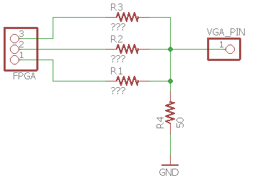

# ECE3400 Fall 2017

1.  The TAs should start every lab with a brief introduction to what the students are supposed to do. Make sure everyone knows where the lab-instructions are located. Keep your intros brief so that everyone can get onto their work.
2.  If the same question appears many times during a session, it is a good idea to ask everyone to pause their work, and discuss the questions with all four teams at the same time.
3.  Near the end of the lab, when the first teams have started wrapping up, you should again address all the teams, and remind them to write up everything on their webpage, and what is needed to complete the next milestone.

## Lab 3 TA Reference
### Introduction
This lab is all about working with FPGAs and digital communication. Here are some talking points for the start of the lab, feel free to use as many or few of these as you want.
* **What is an FPGA?** Describe differences between FPGAs and microcontrollers. Go over some of the advantages and disadvantages of FPGA compared to microcontrollers.
* **Difference between Verilog and other programming languages:** Explain what a hardware description language is and how it is different from other programming languages, such as C or python. Describe what makes a hardware description language useful or list some applications where hardware description languages perform better than traditional programming languages.
* **Parallel vs. serial communication:** Explain the difference between parallel and serial communication. Go over the advantages and disadvantages of each.
* **Digital communication protocols:** Review how some common digital communication protocols work, such as SPI, I2C, or serial. Explain some advantages and disadvantages of each. If you have used some of these protocols, describe how you applied them.
* **How VGA communication works:** Describe basics of how a VGA monitor displays images. Explain why a resistor D2A converter is needed to display color.
* **Methods of waveform generation:** Go over some techniques for generating waveforms using FPGAs and microcontrollers, such as using fast algorithms that approximate waveforms, using a look up table, or using additional hardware, such as oscillators. Go over the advantages and disadvantages of each approach and give some description of how each approach can be implemented.
* **D/A converters and their uses:** Describe what D/A conversion does and why it is useful. Go over different methods of D/A conversion, such as using ICs, using resistor ladders, etc. Go over some of the limitations on D/A conversion, such as conversion speed, accuracy, and resolution.
* **Resistor D/A converter:** Explain specifically how the D/A converter on the VGA adapter works. Make sure the students know that each VGA pin has a load of 50&Omega;. Go over how to calculate the voltage each digital pin should contribute and how to calculate the resistance each digital pin should have to drive. This is explained in detail in the extra help section.
* **Different ways of representing the maze:** Discuss some different ways of representing the maze, both in data and on the computer monitor. Go over some advantages and disadvantages of each methods. An example would be discussing the trade off between representing walls as standalone "blocks" or using the edges of path "blocks" as potential walls. The first approach requires more total blocks, but each block needs to carry less information, as it only needs to describe a block as being a wall or not being a wall. The second approach needs each block to describe if any of its four sides are walls, thus requiring more information.

### Team materials
* 2 Arduino Uno
* 2 FPGA DE0_nano
* 1 VGA screen
* 1 VGA cable
* 1 VGA connector
* 1 VGA switch
* 1 set of speakers
* 1 Stereo phone jack socket
* 1 8-bit R2R DAC
* Various resistors

### Useful references
[DAC datasheet](http://www.bourns.com/docs/Product-Datasheets/R2R.pdf)
[What is VGA?](https://www.computerhope.com/jargon/v/vga.htm)
[VGA communication](https://electronics.stackexchange.com/questions/166681/how-exactly-does-a-vga-cable-work)
[SPI communication](https://learn.sparkfun.com/tutorials/serial-peripheral-interface-spi)
[8 bit art](https://make8bitart.com/) (useful for prototyping block designs)
[Hex to RGB converter](http://www.rapidtables.com/convert/color/hex-to-rgb.htm)

### Extra help
#### Calculating VGA voltage divider

***Make sure the students calculate the proper resistor values, even if their VGA adapter already has resistors soldered on to it!*** The calculation of the resistor values is not trivial, and requires some thought. The students should first establish the voltage each pin needs to output by itself. This is done by setting the sum of all the voltages generated by the pin equal to 1V, then establishing a relationship between the voltages, such as the pin representing the MSB has twice the voltage of the 2nd MSB, etc. Using this, students should be able to find the output voltage for each bit. Next comes finding the resistor values. This can be done by setting one pin high, then, using the voltages calculated earlier, establish a relationship between the resistances. This can also be done by setting any combination of the pins high and using the sum of the voltages found earlier. Eventually, the students will have a set of equations that they can use to find the resistance required for each pin. It is highly recommended they use some form of graphing or equation solving software to calculate these resistances.  

Resistor Values:

#### Drawing to the screen
It is best to decide on a good system for drawing the maze as early as possible. One of the most common solutions is hard code the RGB values for each pixel in a "block," where the block is a 32x32 square of pixels. Theses blocks may be further divided in smaller blocks, making it so the user has to specify the color in fewer pixels. The blocks can vary in size, but there should be enough blocks to represent every type of wall/treasure/path/inaccessible combination the robot may find. A general style or theme should be agreed upon fairly early on, as it will take some time to create each of the blocks, especially if the team agrees upon an elaborate or highly detailed design. The most common themes are generally retro 8-bit ones, as they are the easiest to draw with the FPGA. Some teams in the past have had animated robots, treasures, and backgrounds.

#### Playing sound through the speakers
The easiest signals to play through the speakers are square waves, but these are not very pleasing to the ears and are not score highly, if at all, during the competition. Triangle waves can be made with the FPGA using a counter or adding circuit and some logic to determine the frequency. More complex signals, such as sinusoids, can be synthesized using look up tables. The speed at which the table is iterated through then determines the frequency of the output. This method can be used to play any type of signal or soundbyte, as long as it fits into the memory of the FPGA.
