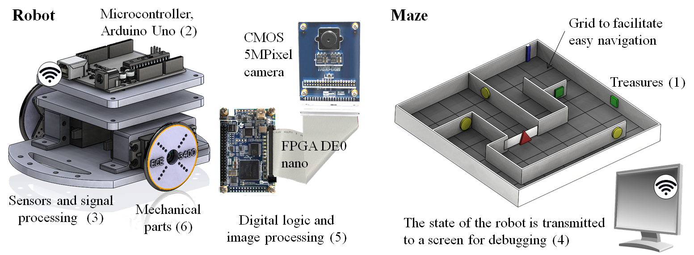

# ECE 3400 Intelligent Physical Systems

* **Cornell, Fall 2017**
* **Class hours:** Monday, Wednesday, and Friday in Kimbal Hall B11
* **Lab hours:** Monday 1.25-4.25pm, Monday 7.30-10.30pm, Wednesday 7.30-10.30pm, Thursday 7.30-10.30pm, Friday 1.25-4.25pm in Phillips Hall 427
* **Instructor:** Kirstin Petersen (khp37)
* **TA's:** Ryan O'Hern (rmo26), Claire Chen (clc288), Christopher Fedors (cjf83), Daniel Kim (dsk252), Leah Forrest (lmf232), Vaidehi Garg (vg254), Vidya Ramesh (vr236), Adarsh Jayakumar (aj373), Justin Selig (jss459), and Curran Sinha (cs886).
* **Piazza:** The main page is located [here](piazza.com/cornell/fall2017/ece3400/home), please sign up [here](piazza.com/cornell/fall2017/ece3400)

***

# Course Description

Students will engage in a holistic design approach to Intelligent Physical Systems which can perceive, reason about, and act upon their environment. This course will expand on the ECE 2000-level courses, and include topics on algorithms, field programmable gate arrays, wireless communication, sensors, actuators, power, and mechanics. Students will learn the value and trade-offs between theory, simulation, and physical implementations, and gain familiarity with rapid prototyping techniques, system debugging, team work, leadership skills, time management, and how to disseminate work to a broader audience through webpages.

_Specific outcomes include:_
* The ability to apply specific design methodologies to the course project
* The ability to evaluate what problems are best solved in software, electronics, or mechanics; as well as the trade-offs between theory, simulation, and practical implementations.
* Efficient team work, as a member and as a leader.
* Effectively communication skills through online media.
* Awareness of professional and ethical responsibilities in the context of Intelligent Physical Systems.

Prerequisites include ECE 2100  ECE 2200 and ECE 2300.  Recommended prerequisite: ECE 2400 (or equivalent).
All information is gathered on this page; no additional textbooks are required.

# Semester Project

In teams of 5-7 people, you will design, fabricate, and program a robot to explore a maze. The robot microcontroller will be based on an Arduino Uno; the default propulsion method will be differential drive with continuous rotation servos. The robot will traverse the maze by following black lines on a white floor; it must also be able to detect walls, an audible start signal, and treasures emitting infrared light at different frequencies. The robot must continuously transmit its progress wirelessly to a base station (also based on Arduino Uno). This base station will communicate with an FPGA that in turn must drive a screen through a VGA interface. Points will be awarded for speed, accuracy, and innovative design methods. The entire robot can cost no more than $100; this [chart](Cost.md) shows how the price is calculated.

All designs must be documented throughout the semester on a group website. The goal is for these websites to be used as a source of reference for future classes. Accordingly, they will be graded with respect to thoroughness and clarity. However, to give teams a competitive advantage, we ask everyone to keep explicit code and circuit designs private until the end of the semester.

[Rules and final scoring chart](./Grading/Readme.md)

[Here is a great video of the course anno 2015.](https://www.youtube.com/watch?v=WN0maCOflVQ)

# Team Composition

The teams will be composed by the TA's and lecturer *without exception*.

Teams will be dependent on lab-time sign-up, student skillsets, and personalities. Before midnight August 23rd please fill out these [Google forms](https://goo.gl/forms/G54ZCPmXbgT65QS32) such that the teams can be formed immediately.

All labs are divided into two sub-labs. To ensure a good mix, it is required that you keep switching partners for the different labs. For example, if student A-F is a team; lab 1 should be solved by A-B-C and D-E-F; lab 2 by A-C-D and B-E-F; lab 3 by A-D-E and B-C-F; and lab 4 by A-E-F and B-C-D. Be sure to note what team members solve the sub labs on the website.

We will prompt team evaluations and practice constructive critiscism. Receiving and giving profesional feedback may be uncomfortable at first, but it is a skill that will help you in any future career.

This [folder](./Grading/Readme.md) includes documents detailing how students will be graded. Be aware that a lot of changes has been made for Fall 2017 and that the score-chart may be changed throughout the semester.  

***

# Schedule and Hand-Outs

Please be aware that the following schedule is tentative and may change throughout the semester.

Week | Topic | Week | Topic
-----|-------|------|-------
1 | Intro, Arduino programming, [Website](tutorials/webpages/webpages.md) | 9 | Prototyping EE, [_LAB 4_](./lab4.md)  
2 | IPS fundamentals, team work/time management, [_LAB 1_](./lab1.md) | 10 | Algorithms
3 | Sensors and filters | 11 | Algorithms, [_Milestone 3_](./Grading/Milestone_score.md)
4 | Embedded control, [_LAB 2_](./lab2.md) | 12 | Evaluating and debugging IPS
5 | Actuators and control, [_Milestone 1_](./Grading/Milestone_score.md) | 13 | Power and Career Center talk, [_Milestone 4_](./Grading/Milestone_score.md)
6 | FPGA, VGA, [_Milestone 2_](./Grading/Milestone_score.md) | 14 | Alternative approaches to IPS
7 | Prototyping ME, [_LAB 3_](./lab3.md) | 15 | IPS Ethics, Final Competition
8 | Wireless communication | 16 | -

See detailed schedule and deadlines [here](schedule.md)

***

# Tutorials and Helpful links

We have and will continue to upload helpful tutorials and links on this webpage. We would love for you to contribute, please contact the TA's to do this!

**Related to Team Work**
* [How to create Gant charts](https://www.smartsheet.com/blog/gantt-chart-excel01) for free in Microsoft Excel for time management
* Excellent [Ted talk](https://www.ted.com/talks/tim_urban_inside_the_mind_of_a_master_procrastinator/transcript?language=en) for those who tend to procrastinate
* [Team contract](./Teamwork/Team_Contract.md)
* [Managing conflict](./Teamwork/Managing_conflict_Chapter_7.pdf)
* [Team assessment](./Teamwork/GroupProcess-QualitativePeerSelfEval.docx)
* [Leadership](./Teamwork/Leadership.md)

**Related to GitHub**

- [Desktop github](https://desktop.github.com/)
- [How to make a webpage](tutorials/webpages/webpages.md)
- [Markdown cheat sheet](https://guides.github.com/pdfs/markdown-cheatsheet-online.pdf)

**Solutions**

[Team Alpha Repository](https://cei-lab.github.io/ECE3400-2017-teamAlpha/)

This is the repository for the team of TA's that solved all the labs during the Summer of 2017. Please use this website for support and inspiration; no credits will be given for close copies of these solutions. Also, the TA's were under strict timelines - hopefully you will upload more comprehensive and better websites over the course of the semester.

**Making Tutorials**

Making tutorials is a great way to earn extra credit. Please confer with the professor before starting. [Here's](tutorials/tutorials.md) a brief tutorial on making tutorials, with a list of possible tutorials we'd like to add.

**Related to Control**

* [Arduino Uno online references and tutorials](https://www.arduino.cc/en/Reference/HomePage)
* [A useful script to report on the internal state of your Arduino](https://playground.arduino.cc/Main/ShowInfo) and [here](https://playground.arduino.cc/Main/ShowInfo?action=sourceblock&num=1)
* Also, for problems with Arduino, look at wiring.c on your development machine to see the firmware settings that are being uploaded to your Arduino.
* [Here's](https://www.pololu.com/docs/0J19/3) a Polulu library reference guide for line following. We will not be using the same line sensors, so the library won’t be installed/used directly. However, reading through the example will give you an idea of how PID control can be used for line following, particularly the command reference for readLine() and the bottom section on PID control.
* [Helpful FPGA-related Links and Tips](./tutorials/FPGA_resources.md)

**Related to fabrication:**

For the first time ever, we have a Skunkworks available to the class complete with a laser cutter, two 3D printers, and a PCB etching station. This is located in PH414. Please be aware that only TA's (and potentially trained students) will have access to this lab, but everyone can request to have pieces 3D printed, laser cut, or etched in there.

- A zip file "ECE3400_Fall 2017_SolidWorks.zip", with all the mechanical parts drawn in SolidWorks can be found [here](https://github.com/CEI-lab/ece3400/blob/master/docs/ECE3400_Fall%202017_SolidWorks.zip)
- Solidworks is available in many of the Phillips Hall computer labs; it is very fast to learn, and the tutorials offered in the help-menu are very intuitive.
- [Tutorials on Autocad](./tutorials/Autocad/AutoCAD_Tutorial.md). Autocad is installed on all the machines in PH427.
- [Autocad example](./tutorials/Autocad/Wheel_Demo.md)
- [Tinkercad](https://www.tinkercad.com/) is a nice free software that many of students have used successfully
- [How to use the XYYZ and UPplus 2 3D printers](./tutorials/3Dprinting/3D_Printing_Tutorial.md)
- [How to use the Epilog laser cutter](./tutorials/LaserCutter/Laser_Cutting_Tutorial.md)
- [Tips on how to design pieces for a laser cutter](./tutorials/LaserCutter/Design_for_laser_cutters.md)
- [Tutorials on Eagle](./tutorials/Eagle/Eagle_Tutorial.md)
- [How to etch your own PCB] To be added.
- [How to solder components and wires](./tutorials/Soldering/Soldering_Tutorial.md)
- [Wiring a robot] To be added.

**Related to debugging**

- [How to build a simple Arduino oscilloscope](https://www.build-electronic-circuits.com/arduino-oscilloscope/)
- [Reading and writing to the serial port with Matlab](https://www.mathworks.com/help/matlab/matlab_external/writing-and-reading-data.html)
- [This folder](docs/simulation/) has software in Java, Processing, Matlab, and C++ for simulating robot search

***

# Teaching Assistants and Instructor

If you have a question that can't be answered by one of the links above, or on the Piazza page, try contact one of your TAs!

I am an assistant professor in ECE, with field appointments in ME and CS. I run the [Collective Embodied Intelligence Lab](http://cei.ece.cornell.edu/) with research on bio-inspired robot collectives. Feel free to contact me with any questions/concerns that don't fit Piazza. I have no specific office hours, but I intend to hang around PH427 in the beginning of many of the lab sessions. When I'm not designing random robots, I'm all about hiking, kayaking, camping, and getting as far from my computer as possible!

I am an M.Eng in ECE focused on embedded software and analog circuitry for biomedical applications. As an undergrad, I was a part of the ESW Biofuels and Engineering World Health (EWH) project teams. When I'm not in one of the Phillips labs, you can usually find me playing chess, rock climbing, or at CTB making a food run. I'm best qualified to answer questions about analog circuitry, firmware design (C/C++), and Verilog. Looking forward to the semester!

I am a senior in ECE, with an interest in analog and digital design and robotics. I am also a member of the Cornell Cup Robotics project team and Cornell IEEE. In Spring 2017, I worked with Vidya in the CEI-lab on a printer that will (in the future) print with mud. Feel free to ask me any questions about your projects. I enjoy everything hardware-related, especially circuit design, board layouts, and microcontrollers. When I'm not pulling all-nighters in Phillips Hall, I can be found pulling all-nighters in Carpenter Hall, running, reading, or trying to learn a new skill.

I am a senior in ECE, with an interest in control systems, particularly those with applications to aerospace. I am also a member of the rocketry project team. Last semester I worked in the CEI-lab on a spider-inspired jumping robot. Please contact me if you have any questions regarding your semester work. I'm especially well-qualified to answer topics on prototyping and electronics layout most of all. I'll also be in charge of the Skunkworks this semester, so if you'd like to make new parts for your robots let me know! For fun I ski, scuba dive, and fly gliders. 

I am a senior in ECE, with an interest in embedded systems and digital design. Last semester, I worked with Daniel in the CEI-lab on a new type of soft modular robot. My strengths include all class topics, but I feel most comfortable answering questions regarding FPGAs and Verilog. When I'm not in Phillips Hall, I'll usually be exploring new waterfalls in Ithaca, rock climbing at Lindseth Climbing Center, or tutoring kids in the Ithaca community.

ADD ALL TA's
