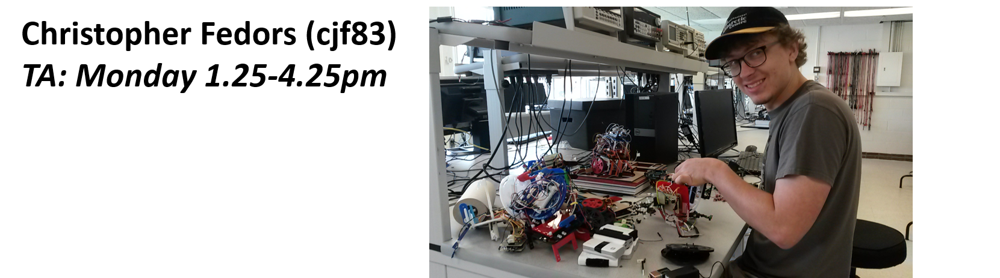
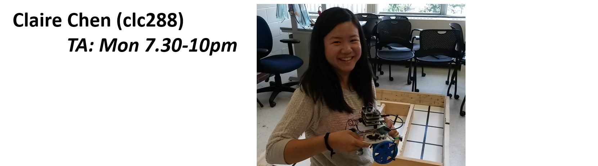

# ECE 3400: Intelligent Physical Systems
## Cornell University, Fall 2017

[Return to main page](https://cei-lab.github.io/ece3400/)

### Instructor and Teaching Assistants

If you have a question that can't be answered by one of the links above, or on the Piazza page, try contact one of your TAs!

I am an assistant professor in ECE, with field appointments in ME and CS. I run the [Collective Embodied Intelligence Lab](http://cei.ece.cornell.edu/) with research on bio-inspired robot collectives. Feel free to contact me with any questions/concerns that don't fit Piazza. I have no specific office hours, but I intend to hang around PH427 in the beginning of many of the lab sessions. When I'm not designing random robots, I'm all about hiking, kayaking, camping, and getting as far from my computer as possible!

I'm a senior double majoring in ECE and CS with an interest in embedded systems. At Cornell, I've been mainly involved in the Cislunar Explorers project in the Space Systems Design Studio working on integrating the power system with a Raspberry Pi as well as the
Collective Embodied Intelligence lab, working on the FORMBots project with Claire. I also enjoy improvising jazz on the piano, sketching, and playing smash in my free time. I'm here to help you make awesome websites - feel free to contact me with any questions on Github and markdown. I look forward to meeting and working with you!
 

I am a senior in ECE, with an interest in control systems, particularly those with applications to aerospace. I am also a member of the rocketry project team. Last semester I worked in the CEI-lab on a spider-inspired jumping robot. Please contact me if you have any questions regarding your semester work. I'm especially well-qualified to answer topics on prototyping and electronics layout most of all. I'll also be in charge of the Skunkworks this semester, so if you'd like to make new parts for your robots let me know! For fun I ski, scuba dive, and fly gliders.

I am at my early admit semester towards the ECE MEng degree, so technically still a senior until this December. I am double majoring in ECE and CS for the bachelor degree with a focus in digital circuits and EDA. I have a lot of interests in robotics and related system in general. Besides this course, I also worked in ASL under MAE department with Prof. Campbell on his autonomous driving Segway systems running on ROS (Robot Operating System), which was a lot of fun. All questions are welcomed, and I can help you the best with ones regarding your path-finding algorithms. I used to play soccer and tennis a lot when I was in high school. After I came to Cornell, I became more of a fan for indoor activities, such as playing Dota 2, and Catan, but above all, my favorite is to read and remember all kinds of maps, and go to those places by myself :)

I am a senior in ECE, with an interest in embedded systems and digital design. Last semester, I worked with Daniel in the CEI-lab on a new type of soft modular robot. I'm happy to answer any questions you have, but I feel most comfortable answering questions regarding FPGAs and Verilog. When I'm not in Phillips Hall, I'll usually be exploring new waterfalls in Ithaca, rock climbing at Lindseth Climbing Center, or tutoring kids in the Ithaca community. Questions about any of these things are welcome as well!

I am a senior in ECE, with an interest in analog and digital design and robotics. I am also a member of the Cornell Cup Robotics project team and Cornell IEEE. In Spring 2017, I worked with Vidya in the CEI-lab on a printer that will (in the future) print with mud. Feel free to ask me any questions about your projects. I enjoy everything hardware-related, especially circuit design, board layouts, and microcontrollers. When I'm not pulling all-nighters in Phillips Hall, I can be found pulling all-nighters in Carpenter Hall, running, reading, or trying to learn a new skill.

I am an M.Eng in ECE focused on embedded software and analog circuitry for biomedical applications. As an undergrad, I was a part of the ESW Biofuels and Engineering World Health (EWH) project teams. When I'm not in one of the Phillips labs, you can usually find me playing chess, rock climbing, or at CTB making a food run. I'm best qualified to answer questions about analog circuitry, firmware design (C/C++), and Verilog. Looking forward to the semester!

I am a first-year PhD student in ECE, working with Kirstin in the [Collective Embodied Intelligence Lab](http://cei.ece.cornell.edu/). I am a computer scientist by training, but a passion for building things brought me into ECE and robotics. You can ask me a question about any topic taught in the course. Outside of the lab I can be seen deadlifting in Teagle or on the mats with the Cornell Brazilian Jiu Jitsu Club.

I am an M. Eng student in Electrical and Computer Engineering with a special interest in embedded systems. I am especially interested in the intersection of technology and healthcare. As an undergrad, I served as president of the Engineering World Health project team, led an initiative called Cornell Make to promote the expansion of makerspaces on campus, and served as Engineering Representative on the Student Assembly. I enjoy working out, studying business psychology, photography, and hanging out with friends. I'm interested in getting to know some of my ECE 3400 students, so feel free to drop me a line. I look forward to working with all of you!

I'm a senior in ECE. On campus I've been involved in research in NBB and ECE (with Vaidehi!) and the Engineering World Health project team. I also went through the leadership program and was a Kessler fellow. Feel free to ask me questions about anything course related or otherwise- I'll do my best to answer or find someone who can! Outside the classroom I love doing fun stuff outdoors, reading, taking photos and drawing :)

Hello! I'm a senior in ECE, and I'm from Bow, New Hampshire. I took 3400 last fall and loved it, and this semester I'm TA-ing the Friday afternoon lab. I'm interested in analog IC design and robotics, and in my free time I enjoy baking and listening to NPR.

Hey Everyone! I’m an M. Eng student in ECE with an interest in embedded systems. On campus I have been involved with research on CubeSats and autonomous systems. Feel free to reach out to me about any of the class topics (or anything else) and I’d love to help out! In my free time I’m usually practicing drums or rehearsing/performing with various musical groups around town.
