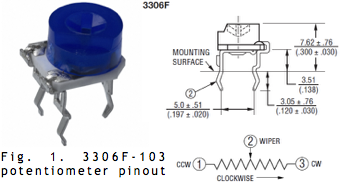

# ECE3400 Fall 2017
## Lab 1: Microcontroller

### Objective
In this introductory lab, you will learn how to use the various functionalities of the Arduino Uno and the Arduino IDE. Your team will brainstorm and construct a simple functional Arduino program using multiple external components and the Arduino Uno. Once you have this basic understanding, you should put together your robot and have it perform a simple autonomous task. If you are already familiar with the Arduino, feel free to let those less familiar focus on the lab, and engage in some of the other tasks mentioned at the end of this page.

### Pre-lab Assignment
* You should have reviewed the [Arduino Reference](http://arduino.cc/en/Reference/HomePage) page and made yourself familiar with its layout and some basic functions and syntax.
* You should also download the [Arduino IDE](https://www.arduino.cc/en/Main/Software) to your laptop.
* Finally, read up on how the [Parallax Continuous Rotation Servo](http://www.parallax.com/downloads/continuous-rotation-servo-documentation) can be used.
* As always it is a good idea to check [Team Alpha's website](https://cei-lab.github.io/ECE3400-2017-teamAlpha/) to see an example of a solution. But please strive to do better than we did!

### Documentation
Throughout this lab and ALL labs, remember to document your progress on your website. Add anything that you think might be useful to the next person doing the lab. This may include helpful notes, code, schematics, diagrams, photos, videos, and documentation of results and challenges of this lab. You will be graded on the thoroughness and readability of these websites.

Remember, all labs are mandatory; attendance will be taken at every lab. All labs will require you to split into two sub-teams, be sure to note on the website what work is carried out by whom.

***

### Procedure

Split into two teams. Each team needs:
- 1 Arduino Uno
- 1 USB A/B cable
- 1 Continuous rotation servos
- 1 Pushbutton
- 1 LED (any color except IR!)
- 1 Potentiometer
- Several resistors (kΩ range)
- 1 Solderless breadboard

#### Communicating between the Uno and IDE

Open up the Arduino IDE and open the “Blink” example code, or “sketch.” Do this by clicking File > Examples > 1.Basics > Blink. The code should pop up in a new window. To program your Arduino, click the checkmark to compile your code and then the right-pointing arrow to upload (program) it.

Note: When you click the right arrow, your code will automatically be re-compiled, so clicking the checkmark isn’t strictly necessary. The Uno’s on-board LED should blink on and off every second. If the LED does not blink, check that the UNO is connected to the correct COM port by looking at the Tools > Serial Port list.

Once your Uno is working as it should, take a minute to look over the code and understand what it is doing. Arduino code is similar to C and is relatively easy to understand just by looking at it. One of the first things you’ll notice are two functions – setup and loop. All Arduino sketches (programs) require these two functions or they will not compile. The setup function runs only once at the beginning of the program. The loop function executes after the setup function and runs continuously until the Uno is turned off.

Refer to the [Arduino Reference](http://arduino.cc/en/Reference/HomePage) to understand what the other functions in the Blink sketch do. If you have any questions, ask!

#### Modify the Blink Sketch

Now that you understand the basics of Arduino code, modify the existing code to work for an external LED (instead of the one on-board that is hard-wired to pin 13). Be sure to connect the LED to a digital pin. *Pins can stop working if you source too much current from them - ALWAYS add a series resistor of at least 300 ohm.* Repeat this for each of the digital pins to make sure that all digital pins work.

#### The Serial Monitor and the Analog Pins

The Uno has several analog pins that work as an input only (these don't need to be explicitly configured as input pins).
Use a potentiometer to input different analog voltages and print these values out to the screen.

The figure below shows a pinout diagram for the potentiometer. You can also access the datasheet for the potentiometer [here](http://www.bourns.com/data/global/pdfs/3306.pdf) - it is part number 3306F-103. The Uno pins read voltage, not resistance, so set up a simple voltage-divider circuit using the potentiometer and a resistor. Connect the output of the circuit to the analog pin, and the supply wires the ground and Vcc pins on the Uno.

As previously mentioned, it is wise to put a ~300 ohm resistor in series with anything you connect to a pin, whether it be an input or an output. This way, if you have set something up incorrectly, it is less likely that you will burn out the pin or any connected components.  

  

Using the Arduino Reference webpage as a guide, think about how to write your setup and loop functions so that the serial monitor outputs the circuit’s analog value every half-second. When defining the analog pin number, use the code int PINNAME = AX;, where PINNAME is your variable name and X is the analog pin number. You can view the serial monitor by clicking on the magnifying glass in the top right corner of the IDE. Of course, the USB A/B cable must be connected to both the Uno and the computer for the serial monitor to work. Repeat the above with all analog pins to make sure they work.  

While there are examples in the IDE that have code for the serial monitor and analog pins, try to figure out how to write the code on your own using just the Arduino Reference page for help. If you get stuck, feel free to collaborate with a neighboring group or ask a TA for assistance.

#### Analog Output

The Arduino can only output digital signals. In order to create an 'analog output', you can use a pulse-width modulator (PWM) – essentially a very fast square wave with differing on and off times. Depending on the load this square wave is often averaged out, creating the effect of an analog or fractional output voltage.

To see how this works, use your existing code for the potentiometer reader to change the brightness of an external LED. Connect an LED to a digital pin (in series with a resistor!) and set it up as an output pin. The digital pin must have PWM capability; this is available for pins with a tilde (~) symbol next to them. Then use the analogWrite function to map the potentiometer value to a brightness value.

Hook up the oscilloscope and check the frequency of the signal and how the on-off times of your PWM change with chancing analog values.

#### Parallax Servos

Your robot propulsion will be based on Parallax Continuous Rotation Servos. You can drive these using the standard Arduino Servo.h library. Connect one servo to the Uno by hooking up the white wire to a digital pin (set to output) with PWM capability. The red wire goes to the 5V output pin, and the black wire goes to ground.

Note: Because servos use a lot of power and can be noisy, you’ll eventually connect the red and black wires to an external power supply consisting of rechargeable [5V battery pack](http://www.monoprice.com/product?c_id=108&cp_id=10831&cs_id=1083110&p_id=13087&seq=1&format=2). When you do this, remember to always have a common ground reference, otherwise your input/outputs will be floating with respect to each other. To actually hook this up you will need a USB-to-wire connection, we'll have these available starting Wednesday 8/30, in the component drawers. 

To use the Servo library, insert the line #include <Servo.h> at the top of a new sketch. At the bottom right of the Arduino Reference page, you will see a link for libraries. Follow that link to find documentation on the Servo library.

The servos you have are different than standard servos – most servos can only rotate a certain amount, while the Parallax ones you have rotate continuously. Because of this difference, it is important to note that calling the Servo function ServoName.write(X);, where X is an integer from 0 to 180 and ServoName is the servo variable’s name, corresponds to a speed rather than a position. If X is 90, the servo will stop. If it is 0, it will rotate one way at full speed, and if it is 180 it will rotate the other way at full speed. Experiment with values of X until you understand how the servo operates. Check the signal on the oscilloscope, what is the frequency and the minimum/maximum duty cycle?

Finally, implement this into your previous code to change the speed of the servo dependent on your potentiometer.

#### Assemble and Run Your Robot

Whoever finishes first should start assembling the robot. For this you will need a chassis, screws, a 9V battery with clip (to power the Arduino), ball bearings, and an allen key. Examine all of your parts, and make sure you understand the purpose of each - make the TAs aware immediately if anything is missing. Once the robot is assembled complete with two servos and a ball bearing, hook it up to an Arduino and make it perform a short autonomous task. E.g. make it drive in figure eights, or a square or similar; remember to record videos for the website!  

***

### If you finish early

Already a whiz at Arduino? No worries, there are plenty of other things to do. If you want credit for this extra work, be sure to add your documentation to the website.

#### Soldering

If you run out of things to do, feel free to practice soldering of components and wires. Check out this [tutorial](./tutorials/Soldering/Soldering_Tutorial.md) and these helpful videos on [soldering](https://www.youtube.com/watch?v=IpkkfK937mU), and [desoldering](https://www.youtube.com/watch?v=Fxu1LAoqTRA) before starting. You can find old soldering wires and electronic components in the large bin in the lab. It is a really good idea to practice ahead of time to learn the technique to avoid, for example, damaging your actual components, or breaking wires during the competition.

Be sure to always obey the following rules:
- Wear goggles when soldering
- Tie your hair if it can get in the way of your work
- Wash your hands after soldering
- Clean the solder iron tip often, and when finished (tin it before storing the iron)
- Turn off the soldering station when you are finished
- Clean your work area after you are done!

#### Mechanical Parts

All the mechanical parts for the robot can be found in this [folder](ECE3400_Fall 2017_SolidWorks.zip). Feel free to download these and check them in Solidworks (available in several of the Phillips Hall computer rooms). You can also start making new parts in Autocad (installed on all lab machines) if you wish. There are lots of tutorials linked from the main page with basic info on how to design new parts - reach out to one of the TA's have them help you fabricate it.

#### Sensors

Start thinking about what sensors you want on your robot. How many are needed? Check out the lab stock. Remember, the entire robot must cost less than [<$100](./Cost.md). If you would like to purchase sensors/actuators that are not in the lab, write up an email to the TA's and the instructor explaining where to buy it and the reason for buying. We will consider these purchases on a case by case basis. Shipping and tax will be taken out of your budget. The earlier you decide on these the better - shipping to Ithaca can easily take a week.

#### Line Following and Wall Detection

If you have plenty of spare time, feel free to add [line sensors](https://www.sparkfun.com/products/9453). Try making the robot follow a black line on the floor and make it go as fast as possible.

You can also add [short range distance sensors](https://www.sparkfun.com/products/12728) or [long range distance sensors](https://www.sparkfun.com/products/8958) to help the robot detect walls. Use the IR sensor’s datasheet to map values to actual distances, and then break those distances down into blocks. Do you need to know that a wall is 6 inches away, or that it is simply one block ahead? Think about this and make a design choice.

Starting early on both these tasks will help you in the milestones and the final challenge.

***

### Wrap-Up and Clean-Up

Keep your Arduino Unos and Parallax servos in the box dedicated for your team. All other components can be placed back into their appropriate bins. Clean up your station thoroughly before you leave!

You should document this lab thoroughly on the website, feel free to add ideas/comments this lab inspires regarding your future robot; the TA's will check the website by the end of the following week. Remember to have a TA note your attendance before heading out.

Use GitHub on the computer to upload and save your code, be sure to add appropriate commit messages. The lab computers will NOT keep any data locally (i.e., on them). Once you log off, the data will eventually be lost (typically overnight). Save your data on a flash drive or other means before you leave the lab.
