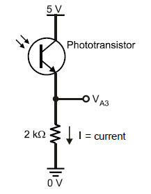
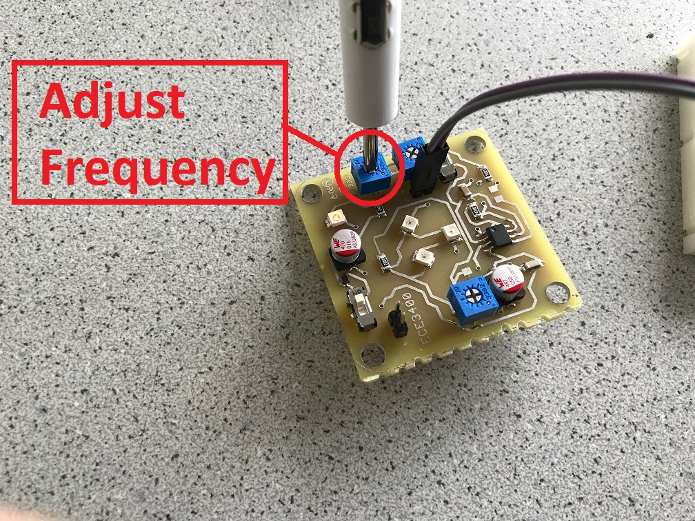

# ECE3400 Fall 2017
## Lab 2: Analog Circuitry and FFTs

### Objective
In this lab, you will add sensors to your robot, and make analog circuits and a digital filter to interface with the Arduino. One is a microphone circuit that will detect a 660Hz whistle blow signifying the beginning of your maze mapping. The other will capture inputs from an IR sensor to detect an IR treasure blinking at 7kHz.

### Pre-lab Assignment
Before you start your lab, you should have familiarized yourself with the analog-to-digital converter on the [ATmega328](http://www.atmel.com/Images/Atmel-42735-8-bit-AVR-Microcontroller-ATmega328-328P_Datasheet.pdf) (Arduino microcontroller).

You should also have looked over the Open Music Labs Arduino FFT library documentation. If you are unfamiliar with Fourier Transforms and Fast Fourier Transforms (FFTs), be sure to check out online resources or textbooks to review the concepts. Your website will be expected to have a sufficient explanation of the basic FFT algorithm.

Look over the Open Music Labs Arduino FFT library example sketches. You’ll see that they use the internal microcontroller’s Analog-Digital Converter (ADC) as fast as it can convert. Look this up online and see how fast it goes, and then compare that to the Arduino’s analogRead function. Is it necessary to use the ADC directly, or is analogRead fast enough? This will depend on your application (reading 660Hz sine wave, or ~10kHz treasure). What might be some concerns of using either method? What’s the normal range of a human voice? Are the harmonics of human speech an issue? What is the frequency of the fluorescent lights in the room? Can they interfere with your IR sensor?

For testing in the lab, it’s a good idea to install an App on your phone that will generate the 660 Hz tone. There are many free Apps for this like Tone Generator for example.

You should also design some simple analog amplifying and filtering circuits so you can add them as necessary once you’re in lab checking out the amplitude of your analog signals. You will especially need an [amplifier](https://cei-lab.github.io/ece3400/Grading/Lab_score.html) on your treasure detection circuit to reliably detect the correct frequency of the treasure. What are some good cutoff frequencies to use in your design? How big of a gain and DC offset is appropriate? (Remember that the Arduino inputs must be between 0 and 5V.)

As always it is a good idea to check [Team Alpha's website](https://cei-lab.github.io/ECE3400-2017-teamAlpha/) to see an example of a solution. But please strive to do better than we did!

### Documentation
Throughout this lab and ALL labs, remember to document your progress on your website. Add anything that you think might be useful to the next person doing the lab. This may include helpful notes, code, schematics, diagrams, photos, videos, and documentation of results and challenges of this lab. You will be graded on the thoroughness and readability of these websites.

Be sure to note on the website what work is carried out by whom. And remember that, if at all possible, you are expected to form different sub teams in every lab.

***

### Procedure

Split into two teams.

The acoustic team will need the following materials:
- Arduino Uno
- Electret microphone
- 1 µF capacitor
- 300 Ω resistors
- ~3 kΩ resistor
- Various other components, as needed

The optical team will need the following materials:
- Arduino Uno
- IR receiver
- 300 Ω resistors
- Borrow a treasure board from the TA's
- Various other components, as needed

#### Download the Open Music Labs FFT library

* Open [Music Labs’ FFT page](http://wiki.openmusiclabs.com/wiki/ArduinoFFT), scroll down and download the newer FFT library folder. Extract this, and then go to My Documents > Arduino > Libraries and put the "FFT" library folder (not the entire "ArduinoFFT3" folder) inside of it. If you have the Arduino IDE open, close it and then restart the program (not the computer) so that it can update accordingly.

* Use the example sketch to start coding. On the FFT webpage, you will find some good, solid documentation on how to use the library. You should have reviewed this before the lab. In addition, the library you just installed has an example sketch that reads in values from Analog Pin 0 and outputs the frequency bin magnitudes via the serial monitor.

* *Unit Test:* Setup a signal generator to deliver a signal that matches what you expect to see from your sensor. This signal must be between 0-5V to not damage the Arduino. Test that the frequency output from your signal generator matches what you see on the serial monitor.

* Optional: You can, for example, use Matlab to debug your frequencies. Matlab can import values from a serial port and plot a graph of your signal. Use the myserialport = serial(comport, ‘BaudRate’, budrateneeded) to initialize a serial port. Set the comport parameter to the port that your Arduino is connected to (under Tools>ports in the Adriano program) and the budrateneeded parameter to 9600. Use the fopen(myserialport) to open the serial port. Read from the port using fscanf(myserialport,’%i’) and plot the value read. Close the port using fclose(myserialport) after you’re done reading.

#### Acoustic Team: Assemble your microphone circuit

The basic circuit for your electret microphone is as follows. It is suggested that you use a 1 µF capacitor and a ~3 kΩ resistor:

* *Unit Test:* Use the app you downloaded during the pre-lab to generate a 660Hz tone. Measure the output from the microphone with the oscilloscope, and try to get an idea of what you need to do to the signal to be able to detect it securely from the Arduino.

* Next, add any additional circuitry you think you need. An amplifier? A analog passive/active filter? If you are adding a circuit you don't need the extra components, just plug one end of the microphone to ground and the other straight into your analog circuitry. Feel free to reference textbooks and the web to decide what circuitry to use. Just be sure that you can fully describe and explain your circuitry choices and how they work when you update your website. Be sure to cite your sources.

* *Unit Test:* Check your circuitry before hooking it up to the Arduino. An amplifier can easily be tested by adding a DC voltage to the input. A filter should be tested by doing a frequency sweep with a signal generator. Once you know that it works, you can test your circuit further by hooking it up to your microphone and checking that the output has a range and a signal-to-noise ratio that works for the Arduino.

* Next, hook up your circuit to the Arduino and try make it detect when you register the 660Hz signal. It is wise to put a ~300 Ω resistor in series with anything you connect to a pin, whether it is an input or an output. This way, if you have set something up incorrectly, it is less likely that you will burn out the pin or any connected components.

* Be aware that during the competition, this circuit must work despite excessive background noise. Your performance will be penalized if you have to start the robot manually and you will get a late start on mapping the maze. Try to recreate this situation during the lab and check if your circuit is robust to audible noise!

* Finally, if you have time to spare, it might be worth implementing an override button right away, such that you can start your robot quickly during the competition in case your microphone circuit fails to recognize the start signal.

* As always, feel free to talk to other groups or a TA if you need assistance!

#### Optical Team: Assemble your IR circuit

Objective: Be able to detect a 7kHz IR beacon with an Arduino using the FFT library.

* A phototransistor lets more current pass the more light it receives. You can look up the one you have available in this [datasheet](https://www.digikey.com/product-detail/en/lite-on-inc/LTR-301/160-1065-ND/153270) (LTR-301). Then connect the sensor as below:

* Prepare your treasure: Measure the frequency output of your treasure with an oscilloscope, adjust the potentiometer using a small screwdriver to make it flash at 7kHz.

* *Unit Test:* Hold your treasure at a realistic difference from the sensor (you can check with the maze that is setup in the front room), and measure the output of the sensor with the scope. Will you need additional analog circuitry before you pass this on to the Arduino?

* While designing additional amplifiers/analog passive/active filter circuits, feel free to reference textbooks and the web to decide what circuitry to use. Just be sure that you can fully describe and explain your circuitry choices and how they work when you update your website. Be sure to cite your sources.

* *Unit Test:* If you have additional circuitry, be sure to test it before hooking them up to the Arduino. An amplifer can easily be tested by adding a DC voltage to the input and an oscilloscope to the output. A filter should be tested by doing a frequency sweep with a signal generator and an oscilloscope on the output. Once you know that it works, you can test your circuit further by hooking it up to your photo transistor and checking that the output has a range and a signal-to-noise ratio that works for the Arduino.

* Next, hook up your circuit to the Arduino and try make it detect the presence and frequency of a treasure. It is wise to put a ~300 Ω resistor in series with anything you connect to a pin, whether it is an input or an output. This way, if you have set something up incorrectly, it is less likely that you will burn out the pin or any connected components.

* In the final competition you will need to distinguish up to three different treasures at 7kHz, 12kHz, and 17kHz. If you have time to spare, check that your FFT works well enough to sense the difference.

* **Remember to turn off the treasure when you're done using it, and to hand it back to the TAs**

* As always, feel free to talk to other groups or a TA if you need assistance!

***

### Wrap-Up and Clean-Up

Keep your Arduino Unos and Parallax servos in the box dedicated for your team. All other components can be placed back into their appropriate bins. Clean up your station thoroughly before you leave!

You should document this lab thoroughly on the website, feel free to add ideas/comments this lab inspires regarding your future robot; the TA's will check the website by the end of the following week. Remember to have a TA note your attendance before heading out.

Use GitHub on the computer to upload and save your code, be sure to add appropriate commit messages. The lab computers will NOT keep any data locally (i.e., on them). Once you log off, the data will eventually be lost (typically overnight). Save your data on a flash drive or other means before you leave the lab.
