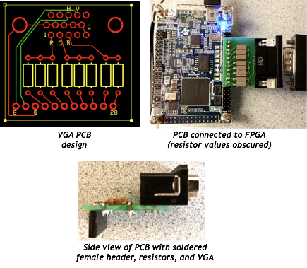

# FPGA Video Controller
## ECE 3400 Fall ’17

### Objective
In lab 3, you will create the foundation for the final Arduino/FPGA basestation. In the final competition, all maze information discovered by the robot must be transmitted from the basestation Arduino to the FPGA, and then drawn on a VGA monitor. Once the maze has been completely mapped, the FPGA must generate a short tune to signify that the maze-mapping is done.

The lab consists of two primary tasks on the FPGA: displaying graphics on the monitor and generating sound. To efficiently complete both tasks, teams will divided into two subteams. One subteam will work on graphics and the other will work on sound. Please read the detailed descriptions and background information for each task in the subsequent sections.

By the end of this lab, you should be able to draw a the current state of a grid (any size) on the monitor, where any state change transmitted by the Arduino to the FPGA is reflected on the VGA display. You should also be able to play a short tune containing at least three distinct frequencies from the FPGA when given a done signal.

### Overview of Tasks

#### Task 1: Graphics
You will begin the task of building a fully-functional basestation by first writing a VGA controller to display graphics on a VGA monitor using an FPGA. The graphics you must display in this lab will be a simplified version of the final maze grid. The state of this grid will be controlled by an Arduino Uno, and any changes made to the grid with the Arduino must be conveyed to the FPGA and displayed graphically. 

To do this, you will need to familiarize yourself with the DE0-Nano FPGA development board, develop a system for transferring image information from the Arduino to the FPGA, and learn how to interact with the video memory and VGA driver.

Look at the provided code for the VGA driver. The VGA driver generates the necessary VGA color and synchronization signals. It also outputs the x- and y-coordinates of the next pixel that is needed. It only has one input - which is the color that corresponds to the last pixel location given. A diagram is shown in the procedure section. During the preparation for your debrief with the staff (to take place between 16-19 September), you will need to decide how you will encode the pixels and their colors. Two important considerations are timing and space: you need to be able to access pixel colors quickly, edit them quickly, and have enough space in FPGA memory to hold all of the pixel values.

The VGA driver outputs color and synchronization signals. It output 8-bit RGB color: 3 bits for red, 3 bits for green, and 2 bits for blue. However, the VGA cable connecting to the monitor only has one wire for red, one wire for green, and one wire for blue. These are analog cables (they take values from 0 to 1 V). We have provided a DAC that converts the given color bits (with a 3.3V digital output from the FPGA) to the desired three color 1V analog signals.

You will use Altera’s Quartus II software to program the FPGA. While there will have been a review of Verilog in class, it is highly recommended that you review how to program with Verilog.

Your work in this lab is the foundation for the final basestation, so it will be helpful in the longrun if you think carefully about how you choose to represent your maze. Spend time thinking about an efficient method of storing the maze data to be displayed. Be sure to agree on a coordinate system to use for your grid _with the entire team_ - this will save a lot of time when debugging.

#### Task 2: Sound
You will use the FPGA to generate a short tune containing at least three different frequencies. This tune will play when the FPGA recieves a done signal from the Arduino. You will use standard speakers provided in lab to play your generated sound. Generating sound using an FPGA requires carefully considering the clock frequency of the overall system to generate waveforms of a desired frequency. 

Materials
- 1 DE0-Nano Development Board
- 1 Arduino Uno
- Various resistors
- 1 empty DAC circuit board
- Solder and Soldering Iron
- 1 VGA cable
- 1 VGA connector
- 1 VGA monitor
- Female header

### Pre-lab Assignment
This lab will be the most intensive of all four labs. As such, it is very important that you have prepared before you begin the lab. Your team will need to schedule a 30-minute appointment here:
https://docs.google.com/spreadsheets/d/1L_cFAYbKFIjP5osEzR8n7xxf76_8KTAVB3BpGt4dwI0/edit#gid=89687802.

This is a debrief, to take place between 16-19 September, so that the staff can make sure that you’re on track. Not all members of your team are required to attend; however, it is required that the team leaders are present, and it is suggested that team members intending to work heavily on the video controller attend as well.

Read the Pre-Lab document on Blackboard carefully…

Look at the provided sample codes for the VGA driver and video memory. The VGA driver generates the necessary VGA color and synchronization signals. It also outputs the x- and y-coordinates of the next pixel that is needed. It only has one input - which is the color that corresponds to the last pixel location given. A diagram is shown in the procedure section. During the preparation for your debrief with the staff (to take place between 16-19 September), you will need to decide how you will encode the pixels and their colors. Two important considerations are timing and space: you need to be able to access pixel colors quickly, edit them quickly, and have enough space in FPGA memory to hold all of the pixel values.

The example code addresses these concerns by condensing the number of locations needed to be remembered from thousands of pixels to hundreds of solid blocks. Another solution would be to use the Nano’s on-board memory (not the logic elements) to allow saving individual pixel values. It is up to you whether you use the sample solution or a design of your own.

The VGA driver outputs color and synchronization signals. For color, it outputs 3 bits for red, 3 bits for green, and 2 bits for blue. However, the VGA cable connecting to the monitor only has one wire for red, one wire for green, and one wire for blue. These are analog cables (they take values from 0 to 1 V). Given that the monitor has an internal 50 Ω load, design a DAC that converts the given color bits (with a 3.3V digital output from the FPGA) to the desired three color 1V analog signals. You will be soldering these resistors onto a PCB – the layout for that is in the Procedure section below.

You will use Altera’s Quartus II software to program the FPGA. While there will have been a review of Verilog in class, it is highly recommended that you review how to program with Verilog.

### Background Information

### Notebook Documentation
Throughout this lab and ALL labs, remember to have each team member document their steps and experiences in their own lab notebook. Notebooks should contain personal notes, schematics, diagrams, and documentation of results and challenges of this lab. These notebooks will be looked over at the end of your lab session to ensure two things: that you were present in the lab (remember: labs are required), and that you are taking good notes. Keep in mind that you will use your notebooks until the end of the final project. The notebooks will keep track of your progress with the labs and project, how the labs tie into the final project. There is a document on BlackBoard with more details about that.

### Procedures

#### Task 1: Graphics

**1. Setup: Open Quartus and understand example code**
Download Lab 3 example code and open Altera Quartus Prime Lite Edition. Open the Quartus Project File (.qpf) and use the project navigator in the top-left corner of Quartus to view all the files in the project.

You should see two .v files:
	1) DE0_NANO.v : The top-level module, which connects to the system clock as well as several other peripherals like on-board LEDs, switches, the two buttons, and both banks of GPIO pins. All your main logic will go in this file. Feel free to write your own modules and instantiate them here.
	2) VGA_DRIVER.v : Module that outputs VGA sync signals. One instance of this module has already been instantiated in the top-level module and connected to a series of GPIO ports. 

Read through both files to understand how each works. Try to figure out what you should see when you program the board. 

Now, compile the project by going to Processing > Start Compilation. Once the project is done compiling (this could take about 30 seconds), program the board by selecting Tools > Programmer. In the Programmer window that pops up, make sure the USB-Blaster is selected, and then hit start to program the board. You should see a green screen on the VGA monitor and LED0 blinking. 

**2. Simple drawings**
To better understand how the VGA driver works, try changing the background color or drawing a square on the screen.  

**3. Design and code a memory system to draw a grid**
Now that you can draw a square, it's time to think about how you will draw an entire maze. Begin by simplifying the problem - rather than trying to draw a 4x5 maze, start with something like a 2x2. You'll need to think about how to display information about each block in the grid without store the color of each pixel in that grid. With the given VGA driver code, create a system that stores grid information and relays the relevant pixel information to the VGA driver when it is requested. The first step is to determine how you can store all the necessary information on the FPGA (memory is limited). There are many ways you can do this and some even allow the use of higher resolution color. After coding the pixel memory system, integrate it with the display driver that you already have. The driver requests colors by screen location and it is up to you to interpret what that means to your storage system. 

3. Create a communication method between the Arduino and the FPGA

Create a system to pass information from the microcontroller to the FPGA using the digital ports on both of these devices. You can send the information serially or through a parallel bus, but be sure to consider timing and other concerns when determining this. Be aware that the DE0-Nano operates at 3.3 Volts, but the Arduino Uno outputs 5 volts on its digital pins. Therefore, you will need to have a voltage divider for each wire connected from the Arduino to the FPGA. You will also need a common ground. Confirm that the TA’s that your choice of resistors is adequate before soldering the components.

The final step is to create a protocol for the information that is being sent, and to interpret the information on the FPGA’s side of communication. The FPGA should be able to use the data to modify the image on the display screen. (Examples of different functions would include: clearing the screen, drawing a wall in a location, drawing a free space in a location, etc.)

#### Task 2: Sound

### Wrap-Up
Keep all circuitry and materials relevant to the video controller in your box. Do not keep USB A/B cables or computer monitors in your box. All other components can be placed back into their appropriate bins.

You should have documented this lab in your notebook; your documentation should include personal notes, challenges, successes, and applicable diagrams.

Make sure to push all code to your teams GitHub repository before you leave lab.

### Report
See the Lab and Notebook Write-Up document on Blackboard for guidelines on how to write the report.

The report for this lab should include the following information in addition to what is specified in the Write-Up document:

1. Your design and well-commented code for the memory system for the pixels, with schematics, code and discussion.

2. How you implemented the communication method between the Arduino and the FPGA, with schematics, well-commented code and discussion.

3. At least a page with any issues encountered, a summary of results, a short explanation on how the lab fits with the final project, and any suggested improvements for the lab.

4. Address what is requested in the Lab 3 Accompanying Handout.

5. Submit your robot’s cost breakdown table as it stands when you submit this lab’s report (separate Excel table appended to your Report, with columns showing Item Description, Quantity, Unit Price, Total Price).

The above information should be placed in the applicable sections of Introduction, Diagrams/Design/Analysis, Experimental Results, and Conclusion that are listed in the Write-Up document. Items 1 and 2 would probably be in both Analysis and Results, and item 3 would probably go best in Conclusion.

If you have a lot of code, feel free to put it in an Appendix and refer to sections of it throughout your report where necessary. It would be helpful to have line numbers for easy reference. Make sure your code is well commented and formatted.

If you have any questions on what to write in your report or how to format it, please contact the staff.

In addition to submitting a hard copy of the report during the week of 12 October, you also need to submit this complete report on Blackboard.

The grading of these reports will not be based on the effectiveness of your design but entirely upon your documentation and written understanding of the lab. This will include a TA review of your lab notebook that contains notes, design sketches, and results/challenges.
