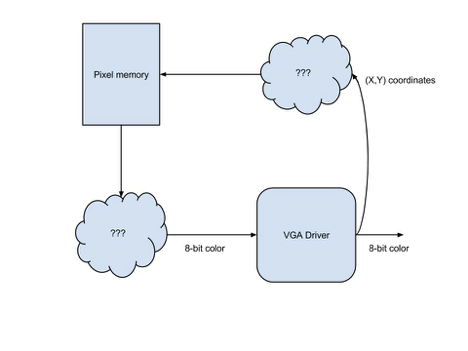

# FPGA Video Controller
## ECE 3400 Fall ’17

### Objective
In this lab, you will create a video controller with an FPGA, controlled by an Arduino Uno. To do this, you will need to familiarize yourself with the DE0-Nano FPGA development board, develop a system for transferring image information from the Arduino to the FPGA, and learn how to interact with the video memory and VGA driver. From a hardware perspective, you will also need to construct a basic Digital-to-Analog Converter (DAC).
By the end of the lab, you should be able to draw a representation of the maze on the monitor such that this representation is on the Arduino, is then sent to the FGPA, and finally to the monitor.

Materials
- 1 DE0-Nano Development Board
- 1 Arduino Uno
- Various resistors
- 1 empty DAC circuit board
- Solder and Soldering Iron
- 1 VGA cable
- 1 VGA connector
- 1 VGA monitor
- Female header

### Pre-lab Assignment
This lab will be the most intensive of all four labs. As such, it is very important that you have prepared before you begin the lab. Your team will need to schedule a 30-minute appointment here:
https://docs.google.com/spreadsheets/d/1L_cFAYbKFIjP5osEzR8n7xxf76_8KTAVB3BpGt4dwI0/edit#gid=89687802.

This is a debrief, to take place between 16-19 September, so that the staff can make sure that you’re on track. Not all members of your team are required to attend; however, it is required that the team leaders are present, and it is suggested that team members intending to work heavily on the video controller attend as well.

Read the Pre-Lab document on Blackboard carefully…

Look at the provided sample codes for the VGA driver and video memory. The VGA driver generates the necessary VGA color and synchronization signals. It also outputs the x- and y-coordinates of the next pixel that is needed. It only has one input - which is the color that corresponds to the last pixel location given. A diagram is shown in the procedure section. During the preparation for your debrief with the staff (to take place between 16-19 September), you will need to decide how you will encode the pixels and their colors. Two important considerations are timing and space: you need to be able to access pixel colors quickly, edit them quickly, and have enough space in FPGA memory to hold all of the pixel values.

The example code addresses these concerns by condensing the number of locations needed to be remembered from thousands of pixels to hundreds of solid blocks. Another solution would be to use the Nano’s on-board memory (not the logic elements) to allow saving individual pixel values. It is up to you whether you use the sample solution or a design of your own.

The VGA driver outputs color and synchronization signals. For color, it outputs 3 bits for red, 3 bits for green, and 2 bits for blue. However, the VGA cable connecting to the monitor only has one wire for red, one wire for green, and one wire for blue. These are analog cables (they take values from 0 to 1 V). Given that the monitor has an internal 50 Ω load, design a DAC that converts the given color bits (with a 3.3V digital output from the FPGA) to the desired three color 1V analog signals. You will be soldering these resistors onto a PCB – the layout for that is in the Procedure section below.

You will use Altera’s Quartus II software to program the FPGA. While there will have been a review of Verilog in class, it is highly recommended that you review how to program with Verilog.

Bruce Land setup a nice webpage with VGA images and instructions:

https://hackaday.io/project/5033-de0-nano-fpga-to-vga-output

### Notebook Documentation
Throughout this lab and ALL labs, remember to have each team member document their steps and experiences in their own lab notebook. Notebooks should contain personal notes, schematics, diagrams, and documentation of results and challenges of this lab. These notebooks will be looked over at the end of your lab session to ensure two things: that you were present in the lab (remember: labs are required), and that you are taking good notes. Keep in mind that you will use your notebooks until the end of the final project. The notebooks will keep track of your progress with the labs and project, how the labs tie into the final project. There is a document on BlackBoard with more details about that.

### Procedure
1. USB driver for FPGA
In case the USB drivers are not installed on your PC in the lab, follow these instructions if you cannot load a program onto the FPGA:
1) Plug in the FPGA to the computer with USB
2) Go to Device Manger
3) Under "Other Devices", Right click "USB Blaster"
4) Click "Update Driver Software"
5) Click "Browse my computer for driver software"
6) The location of the USB driver on the lab computers is: C:\ altera_lite\15.1\ quartus\\ drivers
7) Install the drivers when it pops up. Once it's done installing, you should be able to program the FPGA.

2. Design and code a memory system for pixels
With the given VGA driver code create a system that stores pixel information and relays the relevant pixel information to the VGA driver when it is requested. The first step is to agree upon a pixel color format and determine how you can store all the color information on the FPGA (memory is limited). There are many ways you can do this and some even allow the use of higher resolution color. For ideas, refer to the example code on Blackboard.
After coding the pixel memory system, integrate it with the display driver that you already have. The driver requests colors by screen location and it is up to you to interpret what that means to your storage system. The driver expects an 8 bit color format (3 bits for red, 3 bits for green, and 2 bits for blue), so you may need to convert to this color format before passing the color to the driver.

The clouds in the above diagram are where you input your own code and design ideas.

3. Create a communication method between the Arduino and the FPGA

Create a system to pass information from the microcontroller to the FPGA using the digital ports on both of these devices. You can send the information serially or through a parallel bus, but be sure to consider timing and other concerns when determining this. Be aware that the DE0-Nano operates at 3.3 Volts, but the Arduino Uno outputs 5 volts on its digital pins. Therefore, you will need to have a voltage divider for each wire connected from the Arduino to the FPGA. You will also need a common ground. Confirm that the TA’s that your choice of resistors is adequate before soldering the components.

The final step is to create a protocol for the information that is being sent, and to interpret the information on the FPGA’s side of communication. The FPGA should be able to use the data to modify the image on the display screen. (Examples of different functions would include: clearing the screen, drawing a wall in a location, drawing a free space in a location, etc.)

4. Solder a DAC to convert the FPGA’s output to 3 RGB channels

Use your results from the pre-lab to create a functional DAC and solder it to the PCBs given. This DAC will connect to the RGB channels of the VGA cable, as well as ground and horizontal/vertical sync signals. The PCB schematic is shown in several images below.

You will need to solder wires, appropriate resistors, and a VGA connector onto the PCB. Confirm that the TA’s that your choice of resistors is adequate before soldering the components. The necessary parts will be with the soldering stations (except the resistors, which will be in the bins). Remember to ALWAYS use safety goggles and wash your hands after soldering.

Note: There are many already-soldered voltage dividers left from last year’s laboratory. Many are in good condition and should work fine. You are welcome to use those if you want, or create your own.

### Wrap-Up
Keep all circuitry and materials relevant to the video controller in your box. Do not keep USB A/B cables or computer monitors in your box. All other components can be placed back into their appropriate bins.

You should have documented this lab in your notebook; your documentation should include personal notes, challenges, successes, and applicable diagrams.

Use the GitHub program on the lab computer to save your code. GitHub is a tool that allows you to share and save code and other documents. Using one teammate’s personal account, add the code from this lab as a repository and share it with other team members. If you need to access this code at a later time, you can “clone” it back onto the computer. If you need any assistance with using GitHub, refer to the tutorial on Blackboard or ask a TA.

### Report
See the Lab and Notebook Write-Up document on Blackboard for guidelines on how to write the report.

The report for this lab should include the following information in addition to what is specified in the Write-Up document:

1. Your design and well-commented code for the memory system for the pixels, with schematics, code and discussion.

2. How you implemented the communication method between the Arduino and the FPGA, with schematics, well-commented code and discussion.

3. At least a page with any issues encountered, a summary of results, a short explanation on how the lab fits with the final project, and any suggested improvements for the lab.

4. Address what is requested in the Lab 3 Accompanying Handout.

5. Submit your robot’s cost breakdown table as it stands when you submit this lab’s report (separate Excel table appended to your Report, with columns showing Item Description, Quantity, Unit Price, Total Price).

The above information should be placed in the applicable sections of Introduction, Diagrams/Design/Analysis, Experimental Results, and Conclusion that are listed in the Write-Up document. Items 1 and 2 would probably be in both Analysis and Results, and item 3 would probably go best in Conclusion.

If you have a lot of code, feel free to put it in an Appendix and refer to sections of it throughout your report where necessary. It would be helpful to have line numbers for easy reference. Make sure your code is well commented and formatted.

If you have any questions on what to write in your report or how to format it, please contact the staff.

In addition to submitting a hard copy of the report during the week of 12 October, you also need to submit this complete report on Blackboard.

The grading of these reports will not be based on the effectiveness of your design but entirely upon your documentation and written understanding of the lab. This will include a TA review of your lab notebook that contains notes, design sketches, and results/challenges.
