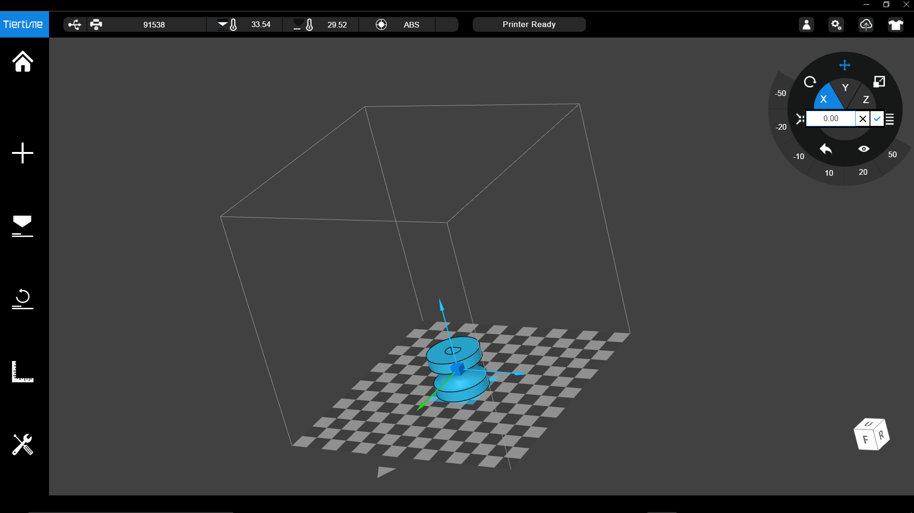

# ECE3400 Fall 2017
## 3D Printing Tutorial
*By Christopher Fedors, July 30th 2017*

## Tricks of the trade
* 3D printing is great for quickly making intricate 3D objects out of plastic. However, it is much slower than making parts in a laser cutter, so if your piece can be made of mostly straight walls this is not the right technology to use.
* 3D printers often have physical limits on the size of the part they can print, and the accuracy with which they can print. Be sure to check the specs of the printer before you build your part.
* Generally, it is much faster to print large flat parts than thin tall parts.
* The printer works by laying down layers of plastic on top of each other. Since the bond between layers is not as strong as the continuously extruded filament within the layer, the parts are always stronger along the horizontal axis. It is worth keeping this fact in mind when you decide on the orientation in which your part should be printed.
* Any overhangs in your piece may need support material during printing. Supports can leave the surface of the part less smooth. A general rule is that overhangs with slopes of 45&deg; or higher can be printed without supports.
* The control software often lets you specify the infill rate of your part. Higher infill results in a more solid part, but uses up more material and takes longer to print. Many printers overextrude filament, and an infill higher than 50% can cause severe problems. Typically 20-30% will result in a very rigid part.
* Be sure to check the size of your part in software before printing. The .stl files used for 3D printing are dimensionless, so double check the units the printer is using and the size of your part before starting your print. You don't want your 2" x 2" part becoming a 2mm x 2mm part.

## Preparing Your Files
### 1. Make sure it is physically possible to 3D print your parts
We have two types of 3D printers available for the class:

[ZYYX+](http://www.zyyx3dprinter.com/store/)
* Located in PH414, used by instructors.
* Maximum dimensions: 265x225x195 mm
* Accuracy: 50&mu;m layer thickness, 11&mu;m XY positioning

[UP Plus 2](https://www.up3d.com/?r=plus)
* Located in PH427, for use by students who have received training
* Maximum dimensions: 140x140x135 mm
* Accuracy: 0.15m layer thickness, 0.15mm XY positioning

### 2. Export your part as a .stl file
Solidworks and Autodesk both allow you to save/export your designs as .stl files. [Here](./stl-files.md) is more info on what an stl-file really is.

### 3. Submit your parts to be printed
Fill out the google form [here](https://docs.google.com/forms/d/e/1FAIpQLScdXLNbjt86BNXwdHtN3UUNWahkpr63f4GTkA4MlCiMCpedHw/viewform?usp=sf_link), and a TA will print your part as soon as they are able to.

## Printing Your Part
## XZZY+
### 1. Run the Simplify3D program
This program lets you preview and layout your prints.

### 2. Import the part/parts to be printed
You can import multiple parts at once by ctrl-clicking.

### 3. Arrange the parts for optimal speed/material usage
Make sure the parts you are printing have the orientation you want. By double clicking on a part, you can change its displacement and angle in any direction. For prints with multiple parts, try placing all the parts close to each other, as this minimizes the time the printer spends moving between parts.

### 4. Check the process
The process controls how quickly and accurately your part will be printed. You can also adjust the infill percentage, which determines how much plastic is used to make the structure of your part. Process also lets you add automatically generated supports and rafts. The raft is a flat layer of material laid down at the base of the part to allow for a level building surface. The supports will be automatically placed under any overhangs and unsupported structures. **When using the raft, it is highly recommended to use supports and place your part some distance above the base of the printer, which will automatically generate supports between the raft and the part.** This is because it is very difficult to separate a part from the raft, but easy to separate a part from its supports.

### 5. Preview the print
This lets you see what will actually be printed by the printer. Everything is color coded based on how fast the printer can print it. The auto generated supports and raft are also shown here. Once you are satisfied with how everything appears in the preview, you can move on to printing.

### 6. Begin the print
1. Make sure the printer is turned on. There is an on/off switch at the back of the printer.
2. Check to see if the printer has enough filament. If the printer is low on filament, load a new spool into the printer.
3. **If you are printing over USB**, click begin printing over USB. There may be an error that says: "This machine does not support binary .x3g files." If you get this error, just click begin printing again, and the 3D printer will start working. **If you are printing using an SD Card**, click on save toolpaths to disk, and select your SD card. Be sure to safely eject the SD card from your computer. Insert the SD card into the slot above the LCD screen on the printer, then use the buttons on the printer to select print from SD. Select the file on the SD card you want to print to start printing.
4. Once the printer starts printing, do not leave it unattended for extended periods of time.

### 7. Removing your print
After your print is completed, use a scraper to get under the base of the part and separate it from the base of the printer. Be careful not to damage the printer's base, as the scraper is very sharp. Also be careful not to injure yourself with the scraper. As a rule, do not push the scraper toward your body or hands.

## Common Problems
### Reloading filament
To reload the filament, use the buttons on the face of the 3D printer to select utilities, then select filament reloading. Next, select whether you want to load or unload filament.
#### Loading
Place the spool of filament you want to use on the back of the printer. Be sure that the filament will come off of the spool in the counter clockwise direction. Make sure that all the filament is wrapped around the spool, as any stray loops could cause the printer to jam. Once the spool is in place, feed the filament up the small plastic tube in the back of the printer. It may require some force to initially get the filament through the tube. Feed the filament until it comes out of the other end of the tube, then feed that into the hole in the top of the extruder. Once the filament is in the extruder, press down on the latch on the right side of the extruder and feed the filament in until it reaches the nozzle. Once you can see the filament coming out of the nozzle, you are finished, and can stop the loading process.  
#### Unloading
Pull back the plastic tube that covers the filament as it enters the extruder and grab the filament. Pull on the filament until it comes free of the extruder. After this, pull the filament out of the printer from the plastic tube on the back. Once all the filament is out, you are done.
### Cannot connect with printer
When the Simplify3D software cannot connect to the printer, the error is usually due to either the printer being physically disconnected from the computer or the computer communicating through the wrong COM port. For the first case, simply plug the printer into the computer using a USB A to B cable. For the other case, select the machine control panel in the Tools menu in Simplify3D program. From here, you can see the COM port being used to connect to the printer and a communication log between the printer and computer. Select the COM port the printer is connected to and click connect to connect to it. If you do not know which COM port the printer is on, try to connect to each of the ports listed. When a connection is successful, there will be several "READ:" and " SENT:" messages in the log, otherwise it will print "failed to connect."
### Aborting print
To abort a print, you can either hit "EMERGENCY STOP" on the machine control panel under Tools in the Simplify3D program or pause the print from the 3D printer itself. To pause the print, press the center button on the printer, then use the down arrow to select pause, then press the center button again to stop the print.

## UP Plus 2
### 1. Run the UPStudio program
This program lets you layout your prints.

### 2. Import your parts to be printed
This can be done by clicking the large plus sign on the left of the screen. The UPStudio plus allows you to import images as well as some basic preset shapes.

### 3. Arrange the parts on the print bed
UPStudio has a radial menu in the top right that allows you to move and modify parts. You can translate, scale, and rotate, as well as Auto Place when you have given your part the orientation you want. Try to arrange your parts in a way that makes them easiest to print.

### 4. Check the print settings by clicking print
This beings up a menu that allows you to configure the layer thickness, infill and print quality. Higher infill makes a part stronger, but uses more material and takes longer to print. To speed up printing, you can also lower the quality and increase the layer thickness. This will result in a generally lower quality part, but it will print very quickly.

### 5. Begin the print
1. Turn on the printer. The on/off switch is on the back of the printer, next to the power cables.
2. Check to see if the printer has enough filament. If the printer is low on filament, load a new spool into the printer.
3. Connect a computer with UPStudio loaded onto it to the printer via USB.
4. Make sure that the base plate for the printer is secured in place. There are 8 metal hooks that hold the perfboard baseplate onto the base of the printer. The printer's base heats up during printing, so wait for the base to cool off if a print has just been completed
5. Initialize the printer. Click the initialize button on the right side of the UPStudio interface. The printer should beep, move the nozzle and baseplate, then beep again once it is completed.
6. Click print under the print menu in UPStudio. This will begin the printing process. **Do not leave the printer unattended for extended periods of time once printing starts. If you cannot finish the print in the course of the lab-hours be sure to check with a TA if they have time to let you in to pick up your part when it has finished. Otherwise, don't start it!**

### 6. Removing your print
It is best to move the baseplate from the base of the printer before attempting to remove any printed parts. Be sure to wait for 5-10 minutes after printing has ended before trying to remove the baseplate, as it is heated during printing. To remove the baseplate, simply pull back each of the metal hooks holding it to the printer's base. Once the base is removed, use a spatula to get between the baseplate and part. Be careful not to damage the baseplate in the process. It may be helpful to use a clamp to hold the baseplate down when using the spatula.

## Common Problems

### Reloading Filament
#### Loading
To load a new spool of filament in, first place the new spool on the spool holder on the side of the printer. Feed the filament through plastic notch above the spool holder, then through the clear plastic tube. Once you have done this, open UPStudio and click on the maintenance tab and select "Extrude". The printer will beep once you have done this to indicate it is warming up. Place the filament through the hole in the top of the printer. Once the printer beeps a second time, it will begin feeding filament through the nozzle. Once you see filament begin coming out of the nozzle, you can stop the extrude process. The new spool of filament has now been loaded and is ready for printing.
#### Unloading
To unload filament from the 3D printer, run UPStudio and select "Withdraw" from the maintenance tab. The printer will beep once to indicate it is warming up. Once the printer beeps a second time, gently pull on the filament above the printer head. The filament should start coming out of the printer head. Once all the filament is out, the printer will beep a third time and stop the withdrawing process. From here you can feed the remaining filament out of the plastic tube between the spool and printer head, then remove the spool.
### Aborting print
To pause the print, press the pause button in UPStudio. Pausing allows you to restart the print later. You can completely abort the print by pressing stop, as this does not give you the option to resume later.

