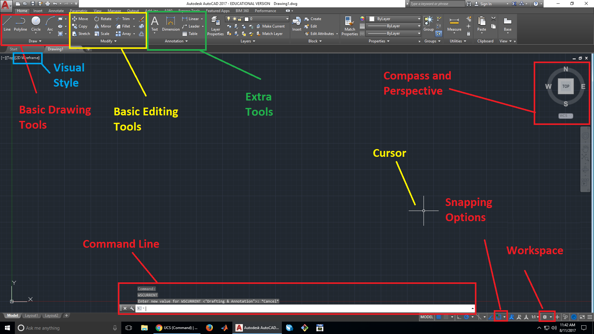
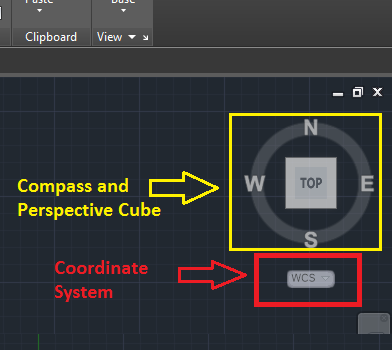

# ECE3400 Fall 2017
## AutoCAD Tutorial
*By Christopher Fedors, July 30th 2017*
## Uses for AutoCAD
AutoCAD is a CAD (Computer Aided Design) program that allows you to design various mechanical parts. These parts can then be laser cut, 3D printed, or machined.
## AutoCAD basics

### Open up a new drawing file
The default AutoCAD file type is a .dwt drawing file. You can open up a template file, but the default blank file will have just about everything you need for most designs.
### Workspaces

#### Navigating the workspace
You can drag the camera around the workspace by clicking with the middle mouse button and dragging. You can zoom in and out by scrolling up and down on the mousewheel, respectively. In the right-hand corner of the screen, there is a cube with its sides labeled "TOP," "FRONT," "LEFT," "RIGHT," "BACK," and "BOTTOM." This indicates the perspective you are viewing your drawing from. You can click on the edges of the cube to change your perspective and click on a face to snap to that perspective. You can also click and drag on the cube to change the perspective. The cube is also surrounded by a circle with the cardinal directions labeled. This compass is present so that you always know the camera's orientation when viewing the part. You can also snap your view of your part to a direction by clicking on direction.
#### Changing the User Coordinate System (UCS)
The User Coordinate System specifies the 2D XY work plane. The work plane is the plane that all 2D drawings snap to. To change the UCS, click on the WCS button underneath the compass in the top right corner of the screen. Select the "New UCS" option. First you must specify a new origin, then the new X and Y axes. You can switch back to the default work plane by selecting the button underneath the compass and selecting WCS.
#### Workspace visual style
The visual style of the workspace can be very important, especially when working with complex 3D shapes. Clicking on the visual style in the top left corner allows you to select from all the visual styles available. 2D Wireframe is good for drafting, but Conceptual might be better for visualizing 3D models. Try out each visual style and find the one that works best for you.
#### Changing workspaces
On the bottom right corner of the screen is a gear. Clicking on this gear brings up a list of 3 different workspaces, Drafting and Annotation, 3D Basics, and 3D Modeling. Each workspace has a different tool layout, optimized for each of the 3 tasks. The most useful to you will likely be the Drafting and Annotation and 3D Basics workspaces. The Drafting and Annotation workspace offers all the tools needed for drawing and manipulating 2D shapes, making it the best workspace to start off in. The 3D Basics workspace has more tools for manipulating 3D objects, but still offers some limited 2D drawing options. 3D Modeling primarily has tools for precise manipulation of 3D shapes. It's easy to switch between workspaces, so don't be afraid to switch to the one with the tools you need.
#### Changing Object Snapping
In the bottom right corner of the screen, there is a square with a green dot on it. Clicking on the arrow next to this icon brings up the snapping menu, and allows you to change what type of objects the cursor snaps to. By default, midpoint snapping is turned off, so it might be a good idea to turn it on.

### Command line
AutoCAD has a command line at the bottom of the workspace. You can use this command line to enter commands or use tools quickly, without having to search for an icon in the tabs. Whenever you use a tool, the command line gives you the name of the command associated with that tool, as well as additional parameters you can specify, such as the diameter of a circle or the angle of a line. To specify one of the parameters, type the letters highlighted in blue and press enter.

### Basic tools for drawing
These are some of the most commonly used tools for making basic 2D drawings. Many of these tools may be familiar to those of you who have used other CAD programs, such as Solidworks. Some tools have small arrows next to them, these indicate more options for that tool, which are usually different methods of specifying a shape. Each tool has its command line shortcut in parenthesis, type this into the command line to bring up the tool.
#### Line (L)
Allows you to draw a straight line from  one point to another. You can specify the length of the line.
#### Polyline (PL)
Like the line tool but allows you to add curves to the line through the command line. Also allows you to set the angle and length of lines independently.
#### Circle (C)
Draws a circle on the selected point. The centerpoint and radius can be specified. Typing D allows you to specify the diameter instead of the radius.
#### Arc (ARC)
Draws an arc. This tool has many different options for drawing and specifying arcs, such as 3 point arcs and arcs defined by a center and a radius. For drawing segments of a circle, such as when making spokes for wheels, the startpoint, center, endpoint arc is often the easiest. Experiment with the different methods for drawing arcs and find the ones that are easiest for you to use.
#### Rectangle/Polygon (REC/POL
Draws a rectangle or polygon. You can specify a rectangle using its area, dimensions, or two points.
#### Region (REG)
Regions allow you to make a 2D surface out of any shape enclosed by lines. This is useful if you want to extrude your part and manipulate it in 3D. Regions can also be added and subtracted from each other using the union and subtract tools. In AutoCAD's default wireframe view, there is no visual indicator of regions, but if you change the view to conceptual, all regions will be colored.
#### Union (UNI)
Combines multiple regions into one region, covering the area of all the combined regions. This tool helps merge many simple shapes into a more complex shape. Union also works with 3D objects, combining multiple 3D parts into one volume.
#### Subtract (SU)
Allows you to subtract a region from another region, which deletes the region being subtracted, in addition to any area where both regions overlap. This tool is very useful for making holes in objects for bolts or screws. This also works with 3D parts, allowing you to subtract one volume from another volume.
#### Array (ARRAY/ARRAYRECT/ARRAYPOLAR/ARRAYPATH)
Arrays allow you to create multiple copies of the same part in a pattern. There are several different types of arrays: rectangular, polar, and path. Rectangular arrays will copy your object into a rectangular grid, polar arrays will copy objects in a circle around a centerpoint, and path arrays will make copies of an object along a defined path, such as an arc or a line. Most common operations, such as region, union, and subtract, cannot be used on arrays, so be sure to explode the array if you plan on using its components.
#### Explode (EXPLODE)
Breaks up an object into its component parts (lines, basic shapes, etc.). This tool is very useful on arrays, because it will break up the array into its component objects. This allows basic operations, which cannot be used on arrays, to be used on the individual objects.
#### Move (M)
Moves the select parts from one location to another. When using the move tool, you must specify what point of the object to use as a base point. When you move the object, it is relative to the base point. For example, if the base point is the center of a circle, when you move the circle, the center of the circle will be placed wherever you click. If the edge of the circle is the base point, that edge of the circle will be placed wherever you click. The base point does not have to be on or inside the object you are moving, it can be any arbitrary point.
#### Rotate (RO)
Rotates the selected objects about a base point. The angle of rotation can be specified.
#### Erase (E)
Deletes the selected object.
#### Copy (CO)
Creates a copy of the selected object. Like the move tool, you must select a base point that is used as a reference point when the object is pasted in.
#### Text (TEXT/T)
Allows you to add in text. There are two options, multiline text and single line text. Multiline allows for multiple lines of text, while single line only allows for one line of text.
#### Fillet (F)
Creates fillets, which are rounded corners, between two circles or lines. The fillet radius must be specified by typing "R" after selecting the first object, or it will default to the last radius value used. For 3D fillets, there is the edge fillet command, which will fillet any 3D edge selected.
#### Dimension (DIM)
Visually indicates the dimensions of the selected object. Indicates length for lines, diameter for circles.

### Tools for 3D drawings
#### Extrude (EXT)
Extrudes a flat surface into a 3D volume. The height of this volume can be specified.
#### Edge fillet (FILLETEDGE)
Fillets the selected edge. Type "R" after an edge has been selected to change the radius of the fillet.
#### Revolve (REV)
Revolves a 2D or 3D object about an axis to create a new 3D object. This is very useful for making round objects, such as wheels, since you can define the cross section of the wheel and revolve it.
#### Loft (LOFT)
Creates a surface between cross sections. You must select the cross sections in the order you want them to be connected. This tool is very useful for joints between two 3D objects, or for making objects that are defined by their cross sections at various points, such as aircraft wings.
#### Sweep (SWEEP)
Creates a 3D volume by sweeping a 2D area along a path. Is similar to the revolve tool, but the path the area is swept along can be defined.
#### Union (UNI)
"Welds" two volumes together. Functions similarly to unions in 2D.
#### Subtract (SU)
Subtracts one volume from another. Functions similarly to subtract in 2D.
#### Intersect (IN)
Only keeps the volume where 2 objects intersect, deletes the rest of both objects. Also works for 2D objects.
