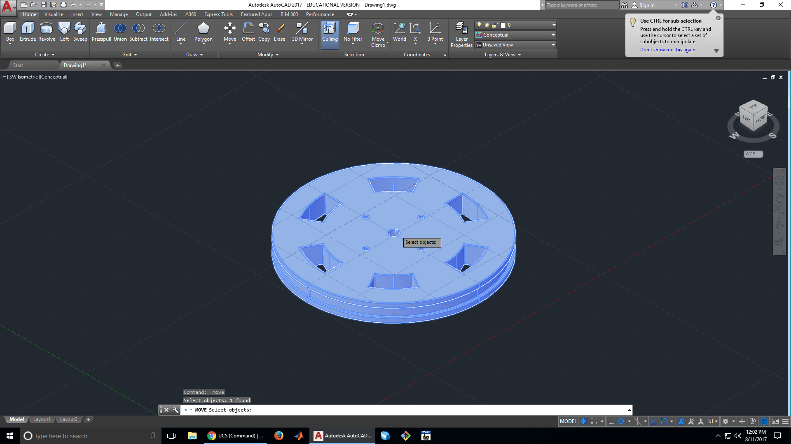
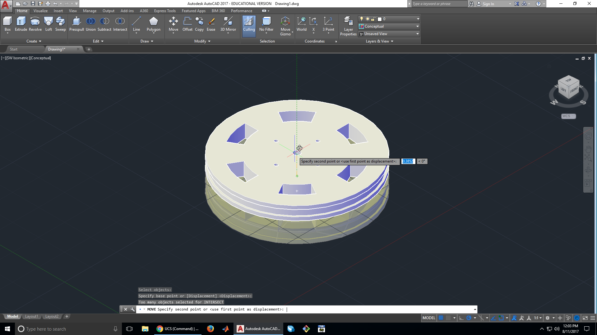
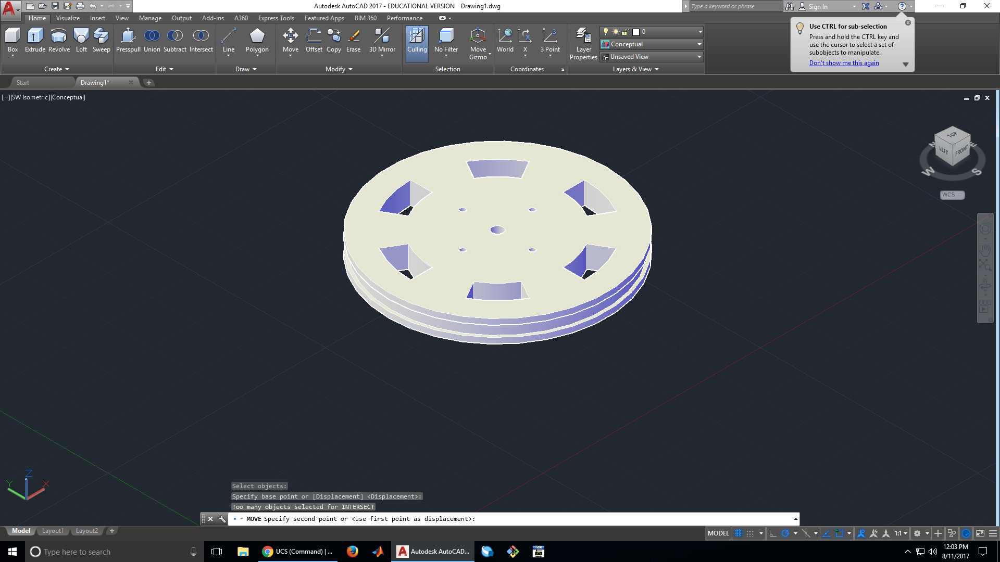

# ECE3400 Fall 2017
## AutoCAD Wheel Demo
*By Christopher Fedors, July 30th 2017*
## Getting Started
### 1. Open up a new drawing file in AutoCAD

### 2. Start by drawing a line
We want this wheel to have a notch in it, so we are going to start by making the profile of the wheel. This first line is going to determine the radius of our wheel, so we set it to 1.25 in.

### 3. Move the line closer to the origin
Our line is kind of far from the origin, so its a good idea to move it closer. The origin will help keep us oriented as we continue our design.

### 4. Start work on the wheel's profile
We want our notch to be 0.125 in. wide, with 0.0625 in. walls on the side. Since the wheel is symmetrical, we can just draw half of the wheel and mirror it, saving us work.

### 5. Mirror the wheel's profile

### 6. Finish the profile
After mirroring the profile, we need to close off the end.

### 7. Change the User Coordinate System (UCS)
The next thing we want to make after the profile is done are spokes for the wheels, as well as the holes for the screws. To do this, we need to create a new coordinate system at 90&deg; to the one we've been using so far. We pick a convenient origin, then place our X axis on the old X axis and the Y axis on our old Z axis.  

### 8. Make the center screw hole

x`
