# ECE3400 Fall 2017
## Making a webpage with a Bootstrap theme

*By Daniel Kim, October 14th, 2017*

### Bootstrap
The purpose of this tutorial is to get you familiar with how to modify existing Bootstrap themes so that they can be used to make nice looking websites. As you will see, it's fairly straight forward but it does help to have some basic understanding of html and bootstrap. For this, I recommend this [video](https://www.youtube.com/watch?v=5GcQtLDGXy8). The Bootstrap documentation is very helpful as well and can be found [here](https://getbootstrap.com/docs/3.3/components/). I'll walk through converting a sample Bootstrap theme into one that can be used for lab documentation, which should give a good starting point for you to start looking at other themes and being able to modify them.

### Picking a theme
The theme I'll be using for this tutorial is called Freelancer which can be downloaded [here](https://startbootstrap.com/template-overviews/freelancer/). This theme was ideal since it was meant for a portfolio so it already had slots which could be used to fill in the lab documentation and milestones. You'll see that many of the themes on this [website](https://startbootstrap.com/template-categories/all/) have a certain category or intended use. You can browse through them and find one that fits your needs. 

### Quick look at index.html
*A quick tip: The most efficient and helpful way I found to work on websites was to have a split screen, opening the index.html file in a text editor as well as a web browser. After each change to the index file, you can refresh the browser to quickly see your changes. This is also helpful for when you are trying to figure out the structure of the index file so you have a side by side comparison of the code and the website itself.*

The only file you really need to modify is the index.html file. Although it can be a bit daunting at first, doing a quick scan through the index file of the Freelancer theme, we can see that it is nicely commented in sections that indicate the function of each block of html code which makes things a lot easier for editting. For example, the Navigation section pertains to the navbar at the very top of the website and the Header section determines what the green section with the title 'Start Bootstrap' looks like:

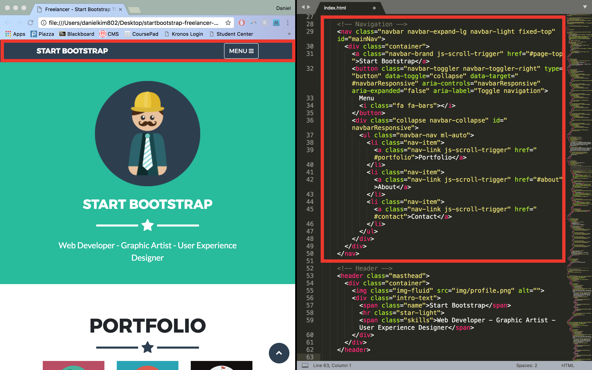

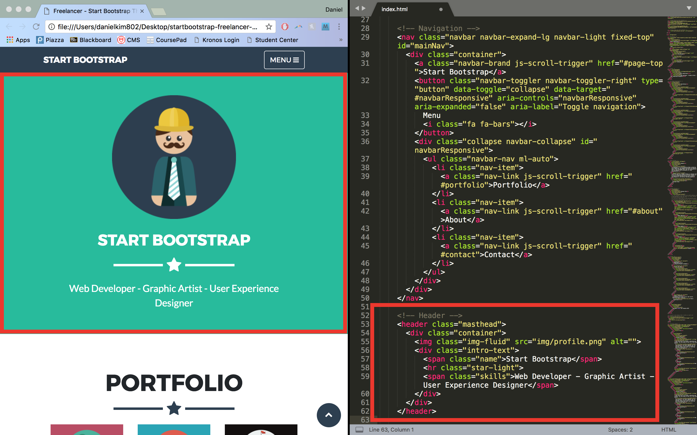

Additionally, we can see a section titled 'Portfolio Modals'. These are responsible for formatting the popups that come up when you click on one of the items in the portfolio section (called modals). This is where we will be placing our labs and milestones. 

### Headers
Some trial and error can go a long way in trying to figure out how the html code is structured and functions. Let's try changing the header to something more useful. Under the navigation section, we can see that there is a class 'name' with the text 'Start Bootstrap'. Changing this as well as the navbar text to 'Team Zeta' and the subtitle text, we get the following: 

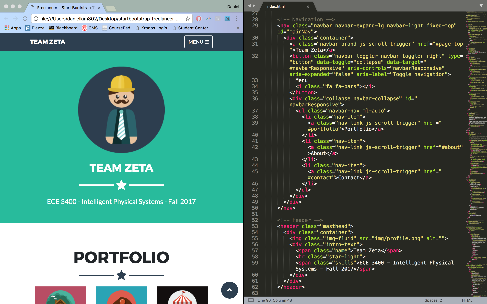

### Portfolio items
We can now start to add in some additional text to indicate labs and milestones. For this, we navigation to the portfolio grid section of the html code. Inspecting the code, we can see that a single project is encapsulated in a class 'col-sm-4 portfolio-item' with additional subclasses specifying the modal link and icon:

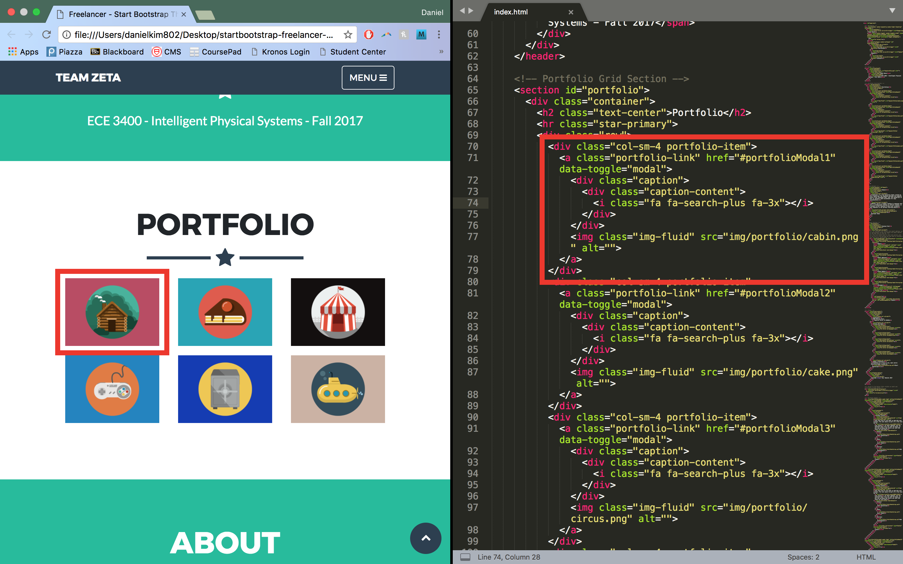

The 'portfolio-item' component is a style specified by the theme and 'col-sm-4' is a Bootstrap class. One of the useful aspects of Bootstrap is that it takes care of formatting across multiple screen sizes and dynamically changes the layout depending on how large the window is. It does this by seperating the window into 12 columns; we can specify how many of these columns an element takes up at a given size. So the 'col-sm-4' class indicates that the portfolio item will take up 4 columns when the window is small. Any smaller and it will reformat the items to be vertical. Likewise, if we change the class to 'col-md-4', the items will revert to a vertical format when the window is medium-sized.

Since we need 4 labs and 4 milestones, we need to add an extra column to the portfolio grid. We can do this by simply copy/pasting a portfolio item: 

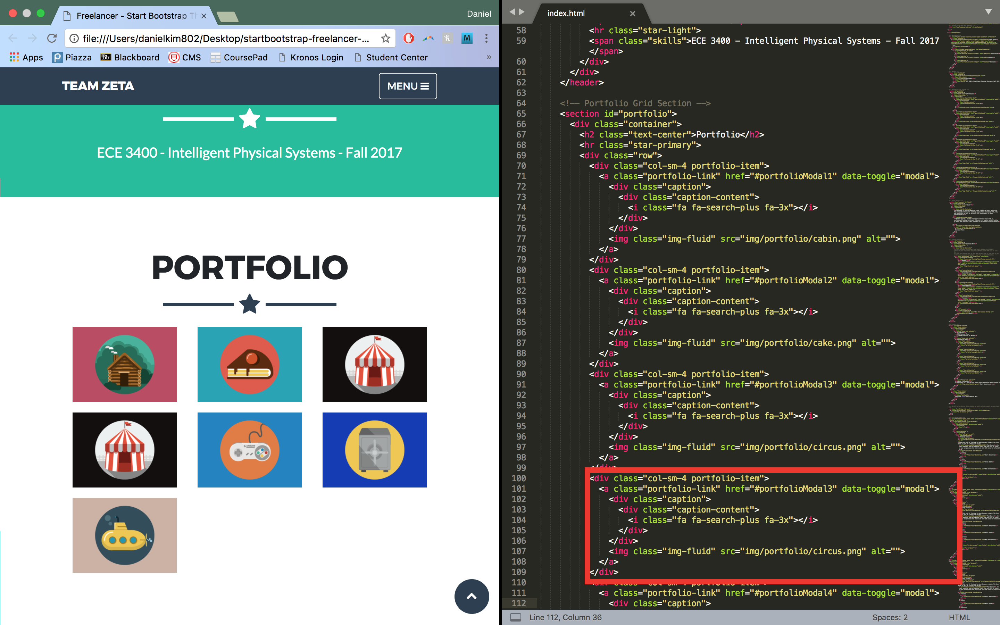

It's not quite what we wanted though; we were expecting four portfolio items to fill the top row and the three remaining ones to stay in the bottom. This is because all of the portfolio items are still taking up 4 columns of the grid. Changing to 3 columns, we get the correct layout: 

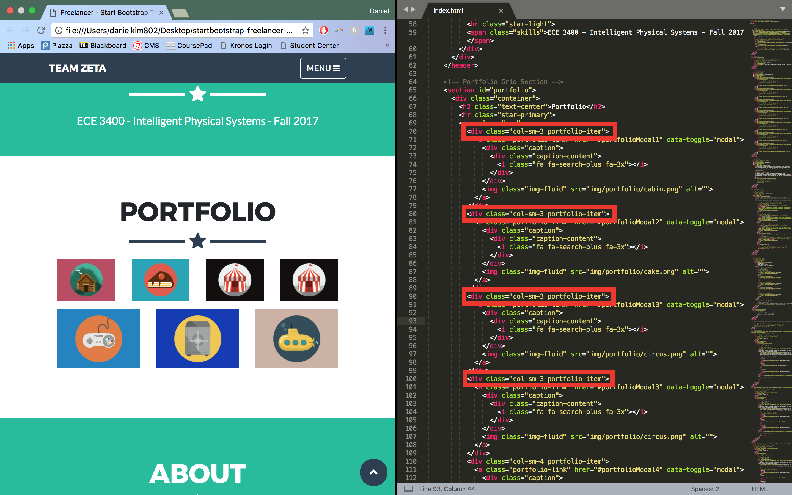

We can do this for the bottom row as well. Additionally, we can add text under the icon by adding a bootstrap text class like so: 

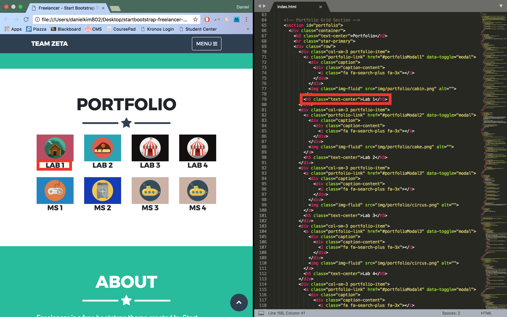

The 'text-center' class is part of Bootstrap and centers the text component as you may have guessed. 'text-left' and 'text-right' are also valid classes. The 'h5' tag is a component of html which determines the size of the text by the header level. 'h1' is larger than 'h5' and so on. 

*Note: Because we copy/pasted the portfolio items, there will be two items leading to the same modals. Minor point but make sure to duplicate the modal pages as well and link them to the appropriate portfolio items.*

### Adding labs and milestones
#### Text
Now that we have our basic layout set up, we can start working on adding documentation for a lab. We'll focus on lab 1 for now. We need to navigate to the modal section of the code since that is where we will be placing our lab. Clicking on a lab brings up the popup window: 

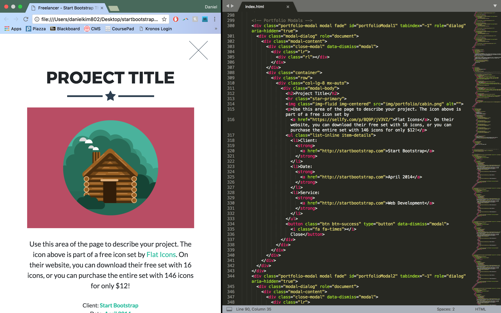

We can easily edit the project title as well as the description as shown in earlier steps: 

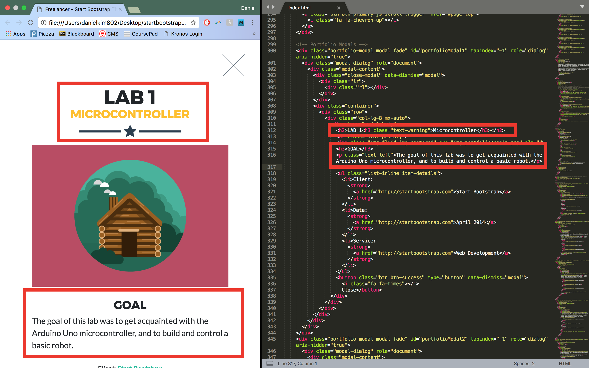

Here, we add a header with a subheader. The subheader has a class 'text-warning' which is another Bootstrap class specifying the color of the text. Additional color classes include 'text-primary' (blue), 'text-success' (green), and 'text-info' (turquoise). We also add a 'goal' section (with another header) and a paragraph under it with left alignment which was explained earlier. The paragraph tag is an html component which specifies that the block of text should be treated as a paragraph. 

#### Links
To add a link, we can add the following code: 

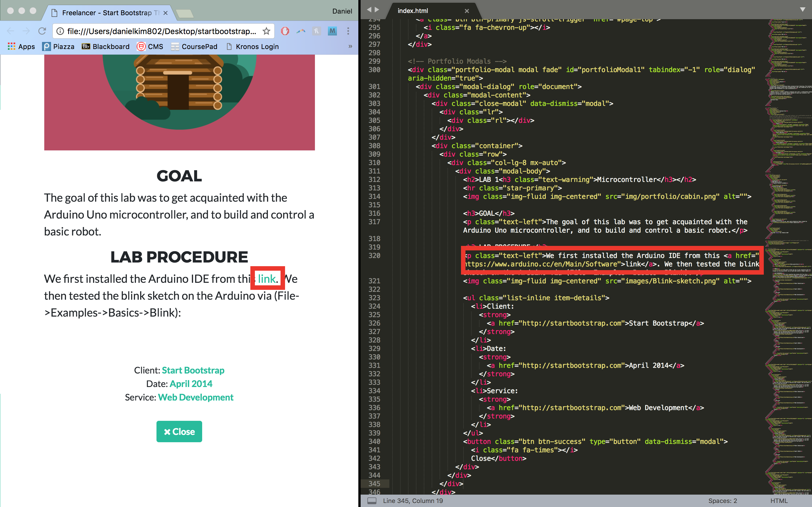

This is fairly straight forward; we simply specify the 'href' field to the appropriate link. Also notice that we can embed different tags within other tags. In this case, we embedded the link tag within a paragraph tag. Whatever formatting that was applied to the paragraph tag (text-left) will also be applied to all inner tags. 

#### Images
To add an image, simply add the following line of code: 

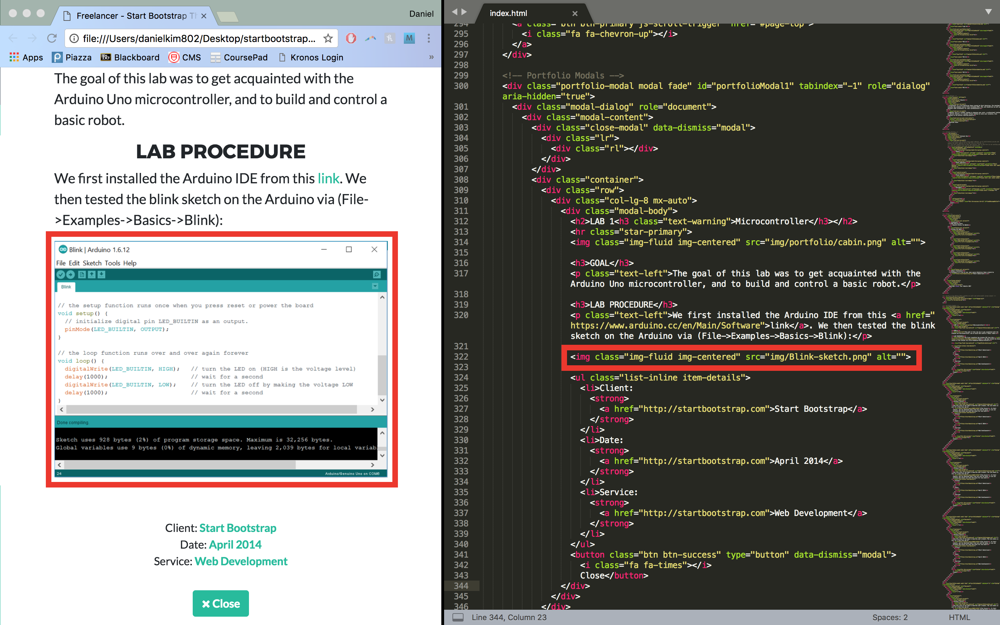

The 'img-fluid' class specifies that the image spans the width of the screen. You simply need to set the 'src' field to the path of the image file relative to the index.html file. 

#### Code and embedding videos
Adding code and videos can be seen below: 

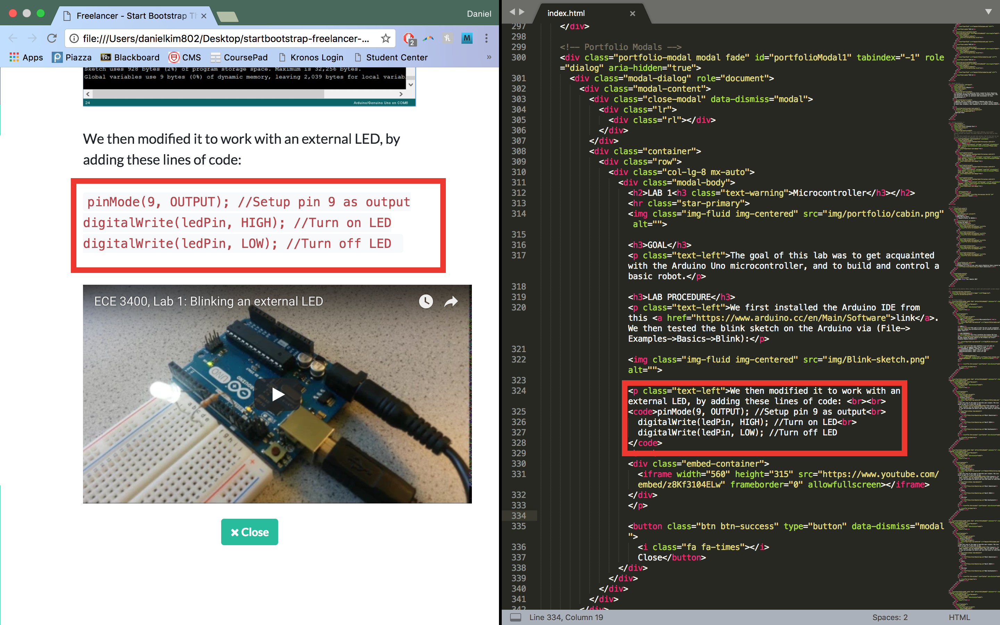

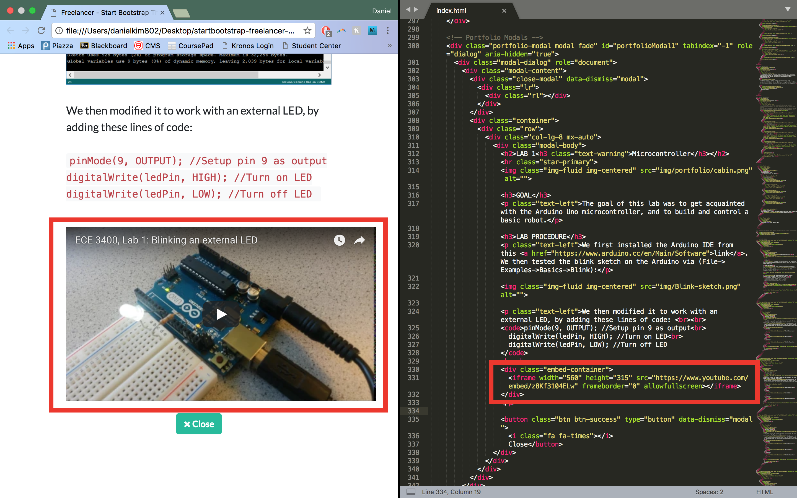

To add code, simply use the 'code' html tag. The format to add an embedded youtube video can be seen above. The URL for the embedded youtube link can be found on the youtube video under share > embed. 

### Overview
Although there are a lot of things I didn't mention here (that was covered by the tutorial linked above), this should be enough to get you started with using Bootstrap. The Bootstrap documentation is also very helpful to learn more about Bootstrap (if you are following the tutorial, make sure to select version 3.x on the Bootstrap [website](http://getbootstrap.com/); the video covers that particular version but version 4 has since been released) or if you're unsure about what a particular class does or how it functions. Overall, you really don't need to know all the ins and outs of html and Bootstrap; like I said above, trial and error is the fastest way of going about learning how the html code works. Good luck and feel free to ask me any questions about all of this if anything was unclear! 
