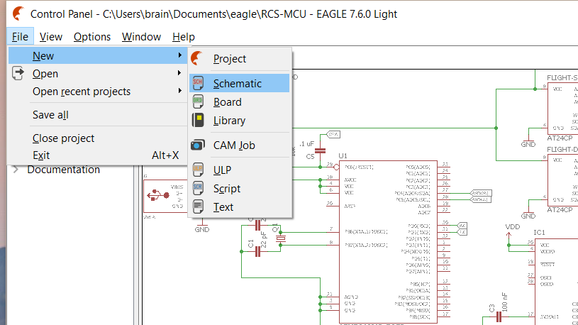
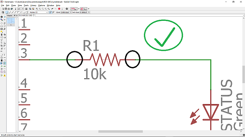
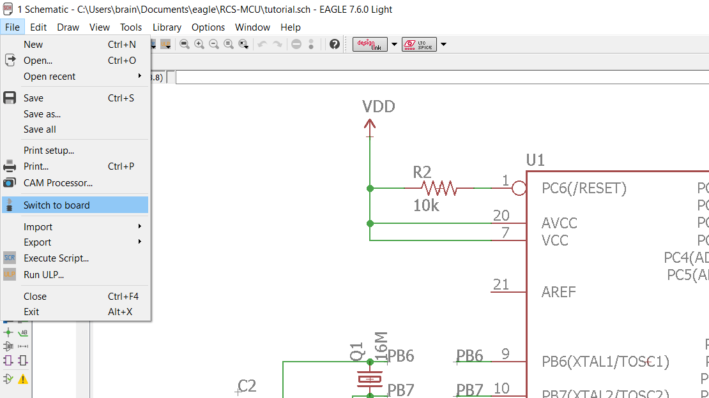
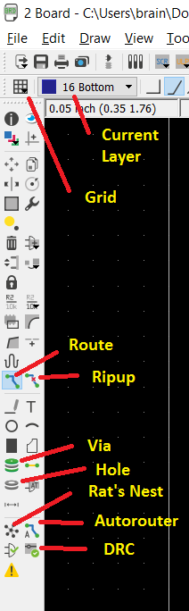

# ECE3400 Fall 2017
## Eagle Tutorial

*By Christopher Fedors July 20th, 2017*

## Uses for Eagle
Eagle is a software program used for making electrical schematics and designing PCBs. Even in you don't intend to make a PCB, Eagle is still a useful tool for digitally laying out electrical schematics. Eagle primarily uses two file types, .sch files for schematics and .brd files for PCB designs.

## Choosing Components
One of the most crucial steps in designing a PCB is choosing exactly what kind of components you will use. Even in the schematic mode, each part you place in Eagle has a footprint, which describes how the part will be mounted to the board. Most Eagle footprints refer to the package a part comes in. Most parts, such as resistors and capacitors can come in a variety of packages, while more exotic parts might only be available in one package. The variety of packages, and therefore footprints, of electrical parts can make the Eagle parts library seem daunting at first, so this section seeks to explain the two types of packages and their advantages and disadvantages.
### Importance of research
Most common circuit components, such as resistors, capacitors, fuses, and some chips, come in two packages, SMD and through hole. You should try and look up what packages the parts you want are offered in, as some parts are only offered in one package. An example of this would be large capacity capacitors being only offered in through hole packages due to their large physical size, or a sensor only being available in an SMD package for its low profile. This means that you must research the parts you want to use beforehand to find out what packages they are offered in, and if that package is practical for you to use.
### SMD
SMD stands for Surface Mount Device. This type of part is designed to be soldered directly onto the surface of a PCB. Typical SMD components are offered in many different sizes, indicated by a 4 digit number in the package name. The larger the number, the larger the size of the device. For hand soldering, it is unadvisable to use any SMD parts smaller than 0805, as very small SMD parts can be prohibitively difficult to solder. The primary advantages of SMD parts are their small size and cheap price. The drawback of these parts is the fact that they can be difficult to solder and can only be used with PCBs, not breadboard or solderboards.
### Through hole
Through hole parts typically have long leads meant to go into the holes of a breadboard or solderboard. These parts have a lot of variation in their footprints, so make sure the dimensions of the footprint of the part in your schematic match the dimensions listed on the part's datasheet. The advantage of through hole parts are that they are very common in the lab, can be used on PCBs, breadboards, and solderboards, and they are easier to solder. Their disadvantages are that they are typically very large compared to SMD parts.
### Different chip packages
Sometimes a chip will be offered in several different packages. Make sure to choose a package for the chip that best suits your needs. Different packages for the same chip often have different pin mappings, so be aware of this. As with regular components, SMD chips are smaller but much more difficult to solder than DIP (Dual Inline Package) chips. DIP chips can also be removed and replaced if a DIP socket is used, while an SMD chip can be difficult to recover after its been soldered.
## Creating a Schematic
To open a schematic in Eagle, simply click on new schematic under the files button on the control panel. This gives you a blank canvas on for you to place your components. It is best to place all of your components and arrange them before you start wiring, as wiring makes moving parts around difficult.

### Placing Components
To place a component, click on the add component button on the left side of the screen. This will bring up a window that lists all the available components. It is often fastest to use the search feature to look for the part you would like, then picking from the results. If you are having trouble looking up a part, add asterisks before and after the part name. These function as "wildcard" characters and will give you more results. If you are just designing a schematic, then the only thing you need to pay attention to is the part's symbol. If you intend to make a PCB of your design, then you also have to pay attention to the footprint and package options for each part, as this is how the part will be mounted to your PCB. Almost all parts in Eagle have a footprint, which is how the part will appear in the board layout phase. Some parts have the same name and symbols but different footprints, so you must pay attention to the footprint of a part when you are selecting it. It helps to have already researched all your parts and selected their packages beforehand. The Digikey and Adafruit libraries have footprints for most common electrical components and chips. Sometimes Eagle just doesn't have the part you are looking for, and you will have to download an Eagle library or add the part to manually to Eagle's library. Sparkfun has a good tutorial for adding parts [here](https://www.sparkfun.com/tutorials/110).

### Wiring
Wiring is how you connect parts together in Eagle. This is done with the net tool. The simplest way to connect two parts is to simply draw a net between their leads. If you right click on the net and click show, the net, and the leads of each part it is connected to, will be highlighted. Be careful not to let nets overlap with the part's symbol, as this does not make a connection.

Right clicking with the net tool allows you to change the way the net is drawn between two points. This can also be done with the by clicking on a drawing style in the top left corner of the screen. In schematics you typically want to keep all the nets at right angles.

A more indirect way to connect two parts is to draw a small net segment on each part's lead and giving each net segment the same name. This will connect the nets, and by extension, the parts. When doing this, it helps to use the label tool to label the name of each net, making it easier to see what each part is connected to. A step by step processes is show below

1. Label the nets you want to connect, and rename one with the name you want to give all the connected nets

2. Rename the other nets you want to connect with the name you gave the first net

3. Select ok when asked if you want to connect the nets

4. Right click on one of the nets and select show to verify that the nets have been connected

### Groups
If you want to move manipulate multiple parts at once, then you should use the group tool. Once you select the group tool, drag a box over or ctrl+click the parts you want to select. After you have selected all the parts you want, select the tool you want to use on the group, such as move, copy, or delete. Then right click on empty space and select "Tool:Group," where "Tool" is the tool you selected in the previous step, such as move or copy.
### Useful Tools

#### Move
Used to move parts around. To move a part, select move, then select the part, then click where you want to move the part to.
#### Name
This tool allows you to change the name of a part. This is great for increasing your schematic's readability, since you are able to rename LED0 to POWER_LED or ERROR_LED. This also changes the silkscreen on the PCB so you will still be able to see the name of the part appear on the PCB when it is printed.
#### Value
The value tool allows you to change the value of a part. Many parts in Eagle don't explicitly tell you what their value is, so you have to set it with the value tool. Be sure to give every resistor, capacitor, and inductor a value, such as 10k for a 10k&Omega; resistor.
#### Label
The label tool allows you to attach labels to your nets. It is wise to label all of your important nets, as well as any nets that are not directly connected.
#### Show
The show tool is used to see all the connections a net makes. This also helps you find out what other parts a component is connected to. To use the show tool, right click on a net and select show or select the show tool and click on the net you want to examine.
#### Copy
Allows you to copy and paste parts. Click on the part you want to copy, then click wherever you want to place to copy.
#### Replace
Allows you to replace components. This is useful when you want to change the package/footprint for a part. Select the component you want to place in, then click on all the parts you want replaced.
#### Smash
This separates the value, name, and symbol of a component. This is most useful in cluttered schematics, as it allows you to adjust the names and values of components so that they do not overlap. To smash a part, click on the smash tool, then click on the part you want to smash.
#### Mirror
Mirrors an object about its y axis. To mirror an object, select mirror and click on the object.
#### Rotate
Rotates an object about its midpoint. Different options for rotation are presented in the top left corner of the screen. To rotate an object, select rotate and click on the object.
### ERC Check
Once you have completed you schematic, it is wise to run an ERC check, which checks for any errors in the schematic. If you click on an error, Eagle will highlight where the error is on the schematic and allow you to process, approve or clear the errors. Processing an error means that you have corrected the error, but still want to check for it on future ERC checks. Approving an error means the error isn't actually an error at all, and removes the error from appearing on any future ERC checks. Clearing the errors is the same thing as processing them, except all the errors are removed from the current list, but will still appear on future ERC checks if they have not been corrected. Be aware that this check is not completely comprehensive, so you should still check over your schematic carefully even if it does pass ERC.

## Adding More Components
Sometimes the part that you want to use is not in Eagle's default library. Luckily, you can download extra libraries to supplement Eagle's standard library. Some manufactures and electronics companies have their own Eagle libraries that you can download. To use one of these libraries, download the library and move the .lbr files into Eagle's lbr directory. Once you have done this, open the Eagle control panel. From here select Libraries, then open the lbr file. This should display all the libraries currently used by Eagle as well as all the libraries you just downloaded. Any library with a gray circle next to it is inactive, and will not be used. All libraries with green circles next to them are active will be used. To activate a library, right click on it and select "Use." You may have to restart Eagle in order for the libraries to start appearing in the component list. The [Sparkfun](https://github.com/sparkfun/SparkFun-Eagle-Libraries) and [Adafruit](https://github.com/adafruit/Adafruit-Eagle-Library) Eagle libraries make good additions to the standard Eagle library.

## Creating a Board
To create a board file from a schematic, click on file and select "Switch to Board." This creates a .brd file that is linked to your schematic. After you have created a board, you must keep both the schematic and board files open while you work. This keeps the two files linked, and allows changes made in one file to show up in the other.

When you first open the board file, all of the components from the schematic will be placed in a group, and the board will appear as a grey outline. In the bottom left corner of the board is a small grey cross. This cross is the origin of the board, and all components must be placed above and to the right of the origin.

The best way to start working on a board is to just start placing your components on the board area. As you start moving parts around, you will gain a better sense of where each part needs to go. The board layout does take some creativity, as there is not set formula for laying out PCBs. The goal should be to get everything in as small an area as possible, but not so small as to make routing too difficult or impossible. Other factors should as be taken into consideration, such as with crystals for microcontrollers, which need to be placed in close proximity to their connected capacitors. There are many factors that may affect PCB design, included below is a short list with some of the more relevant ones to this class.
* Mounting the PCB
* PCB manufacturing process
* Signals sensitive to noise
* High current
* Capacitance of traces/board
* High frequency signals
* Thermal constraints

### Layers
All boards in Eagle are made up of multiple layers. Each layer represents something different, be it silkscreen, soldermask, or text. Each layer has a name and color associated with it. The most important layers to pay attention to are the top and bottom layers, represented by red and blue respectively. These layers are important because they are the layers you will be mounting your parts and drawing your traces on.

### Adding traces
When all of the components are added to the board, they all all connected by nets, which indicate where electrical connections are supposed to be made. These nets are indicated by yellow lines between parts. These nets help visualize the connections between parts and can help you decide where to place parts relative to each other. In order to make electrical connections on the PCB, you have to draw traces between components. Eagle offers two options for this, manually drawing traces or using an autorouter to draw traces automatically.
#### Manually

To manually draw traces between parts, select the route tool from the toolbar and then select the layer, either top or bottom for two layer boards. Once you have a layer selected, click on the pad or net that you want to draw a trace from. From here, you can click anywhere to anchor the trace to that spot. This allows you to draw your trace around the board. Much like nets in the schematic, you can select the way the trace snaps to the board by either right clicking or selection a style from the top left corner. The width of the trace can also be changed from the top toolbar. All the parts connected to the net you are routing will be highlighted. Once you have made a connection, all the parts on the net will cease to be highlighted. To remove a trace, use the "Ripup" tool and click on the trace. To remove all traces on the board, select ripup and click on the green stoplight located underneath the window menu.
#### Adding vias
A connection between different board layers is called a via. To create a via while routing, simply click where you want the via to be placed, then switch the layer you are routing on. This will automatically create a via between the two layers. In the top toolbar you can specify the style of the via, the size of the contact around the via, and the size of the drill used to make the via.
#### Autorouter
Eagle comes equipped with an autorouter that allows you to route simple boards automatically. The autorouter will attempt to route everything in accordance so that it does not violate the DRC check, so be sure to properly set up the DRC before you begin autorouting. To start the autorouter, select an effort and click continue. Higher effort levels result in better routing, but running the autorouter takes longer. After this, a menu will pop up showing progress on different routing threads. Click start to start the autorouting process. Once the autorouter is complete, click "End Job" to accept the results. Clicking cancel will delete all the traces the autorouter has made. Be sure to run the DRC check after you have run the autorouter to make sure all errors have been addressed.
### Useful Tools

#### Hole
The hole tool is used to indicate areas of the PCB where holes should be drilled. You can select the size of the drill to be used in the top left corner of the Eagle interface. Once the tool is selected, simply click on the area where you want to place a hole to place a hole there.  
#### Ratsnest
This button recalculates all the net connections in the drawing, re-drawing each net to its closest connection. This tool can help when the nets on a board drawing are very cluttered or confusing.
#### Grid
Everything, from traces to components, snaps to a grid on the board drawing. Clicking on the Grid button allows you to adjust the resolution or representation of the grid. From here you can also change the units of measurement being used.
### DRC Check
The DRC (Design Rules Check) is used to verify that you PCB does not have any errors that would prevent it from being able to be fabricated. This means that while your PCB may pass DRC for one PCB fabricator, it may not be able to be made by a different fabricator. This means you have to be aware of who is going to be making your PCB before running the DRC. To help with this, Eagle allows you to download different DRC settings from PCB manufacturers. The [Sparkfun](https://www.sparkfun.com/tutorials/115) DRC will work for most PCB fabricators due to its high spacing and trace width requirements. If there is no	.dru file for you to download, you can manually set the conditions that the DRC checks for in the DRC menu.

Once you have your desired DRC settings loaded, click check to start looking for errors. If there are any errors, a box should pop up listing all errors and warnings. Clicking on an error will zoom into the area where there is an error. This functions the same way as ERC is schematic view, so click process to mark an error as addressed or approve the error if you don't want to see the error on future error reports.
