## Example Schematic and Board Creation
This section will go though all the steps required to lay out an ATMega328p and LED on a PCB. This circuit is by no means intended to function, it only serves as an example on how to layout a schematic and PCB in Eagle
### Schematic
The first step in any Eagle project is to open up a new schematic.

All new schematics start out as a blank canvas.

The first part we are going to add to the schematic is an ATMega328p in a DIP package. Since I couldn't find the part by searching ATMega in the add components menu, I added wildcard characters around the name to increase my search results.

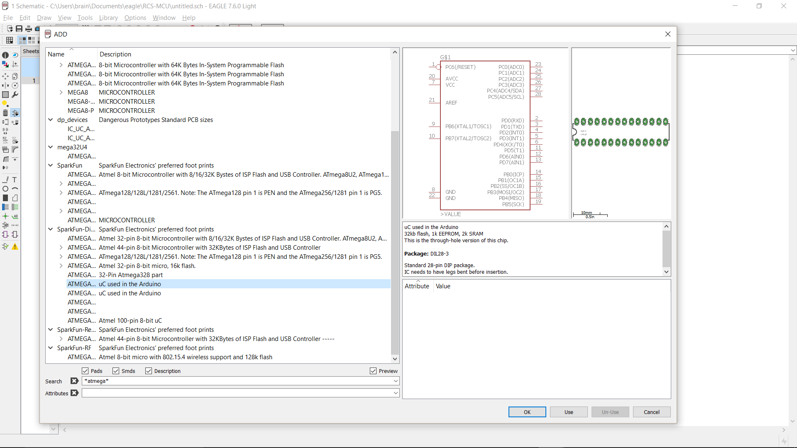

Once I have selected the part with the symbol and footprint that I want, I place it on the screen.

Next we want to add a resistor for our LED. When using an LED, you always want to include an in series resitor to limit the current going into the LED. For this resistor we choose a footprint fot a through hole resistor.

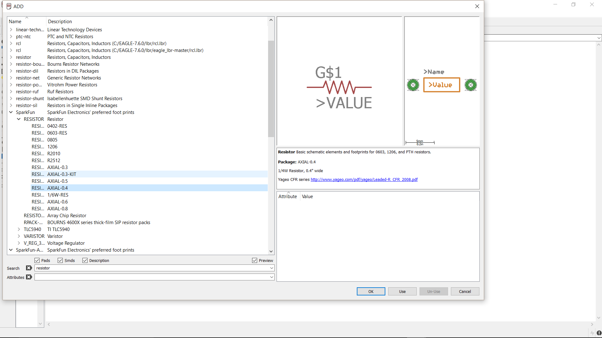

Since we want to use pin PD7 for our output, we place our resistor down close to the pin.

After we have placed our resistor, we need to give it a value. For this tutorial we will give the resistor a value of 10k&Omega;. For very large or small values, use the metric prefix for the closest unit. For example, instead of 10,000, write 10k or instead of .001, write 1m. This helps keep your schematic readable. Be sure to gove all the components in your schematic values.

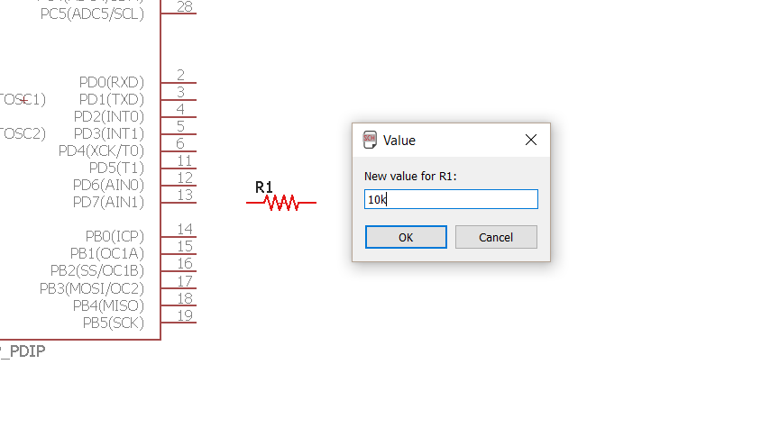

After adding the resistor, we select an LED with a through hole package.

To make our schematic more readable, we want to give the LED a name that is more indicative of its purpose than LED1. Since the LED will be used to indicate the status of the ATMega, we will rename it as STATUS.

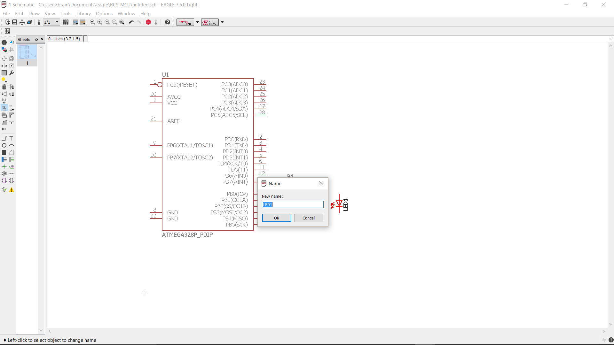

We also want to specify the color of the LED, so we change its value to GREEN.

Next we need to add power and ground sources for our circuit. Eagle has some VDD and GND symbols made especially for this purpose. These parts will connect all nets are attached to, resulting in all the VDD symbols being connected and all the GND symbols being connected. This saves you the trouble of naming and labeling every VDD or GND net.

After adding VDD and GND, we can start connecting all of out components using nets.

It turns out the ATMega neeeds a 10k&Omega; resistor between VDD and its RESET pin. Instead of placing a resistor, we can just copy and paste the 10k&Omega; resistor we were using for our LED.

The ATMega also needs a crystal oscillator circuit, which consists of two capacitors and a crystal. For this demo we are going to connect the crystal circuit indirectly to the ATMega.

The first step in connecting nets indirectly is to label each net. This indicates what each net is connected to in the absence of a direct connection.

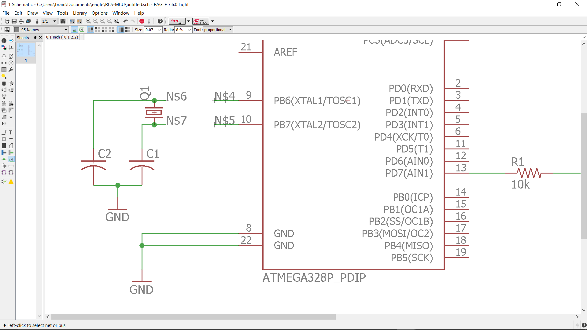

We then rename the nets to connect them. In this picture the show tool is being used to show that the two nets are connected.

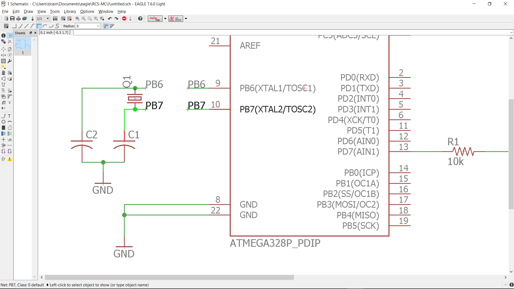

Here is an overview of the circuit before we run the ERC check. Always run the DRC check after you are done making changes to your schematic.

Here we can see 3 warnings the ERC found. It looks like we forgot to give the capacitors and crystal in the crystal circuit values! To address this, we must give all the components values and process each warning.

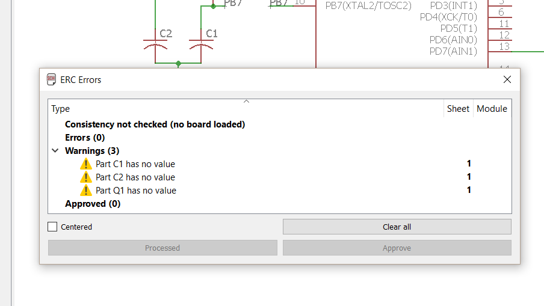

After addressing the warnings from the DRC, we run the DRC again to make sure we resolved the issues. This time the schematic passes the DRC.

### Board
After we are happy with our schematic, we want to switch to our board in order to start laying out the PCB. Since we have not linked a board yet, we have to create a .brd file from the schematic.

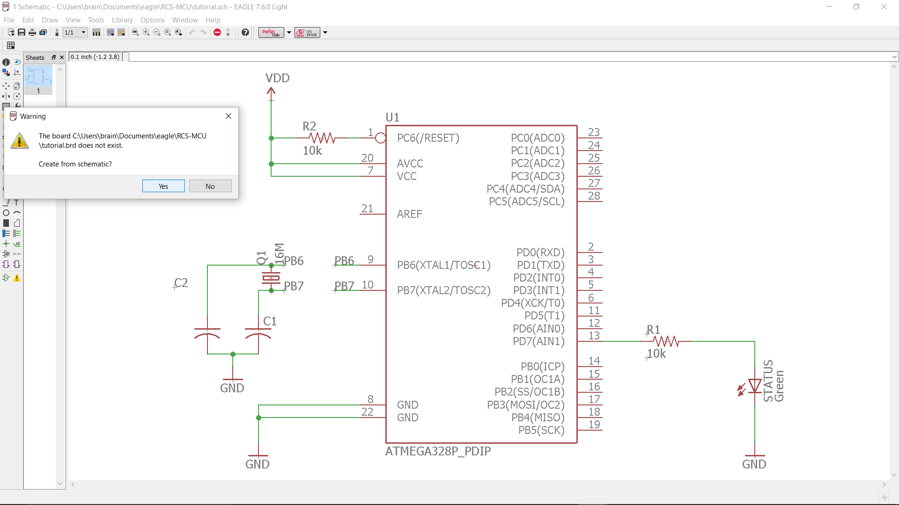

Here is labeled view of what a new board looks like. All the components from the schematic are in the bottom left corner, and the faint gray box is the board outline.

A good first step to board layout is to move all the parts onto the board outline and arrange them in a way that makes routing easy. Be sure to use ratsnest button to update the nets as you move parts around. Since I did not like the footprint of the capacitors I choose in the schematics phase, I switched back to the schematic and used the replace tool to replace the old capacitors with capacitors with a different footprint.

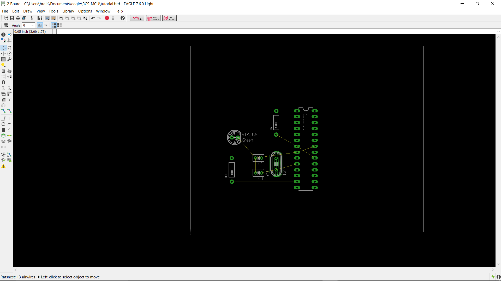

After we have arranged the parts, it is a good idea to resize the board and get rid of any empty space.

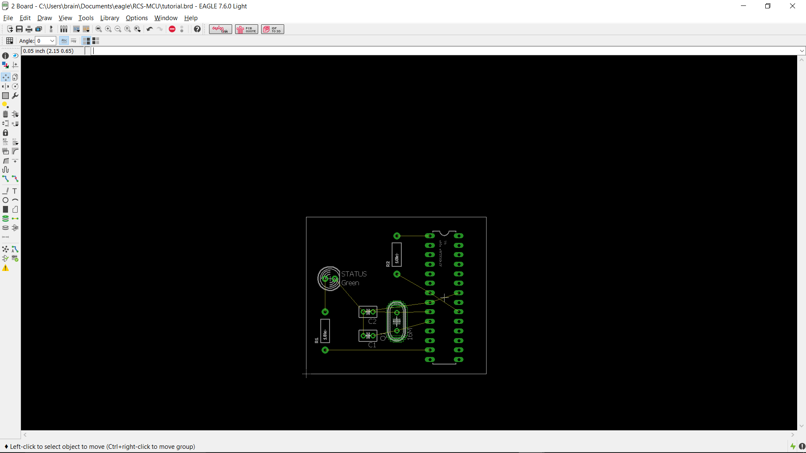

It turns out that the ATMega needs a power source, and we forgot to put one in the schematic! To fix this, we need to go back to the schematic and add a 5V voltage regulator and a barrel jack. The barrel jack allows use to connect to any battery pack with a barrel connector, while the regulator takes the voltage from the battery and steps it down to 5V, which is the power level we want for the ATMega.

Here is our new schematic. The output of the regulator is hooked up to VDD since VDD is our 5V supply.

Switching back to the board, we can see the new parts we added. We must rearrange and resize our PCB to get these new parts to fit.

Here we have our new layout. All of our parts fit on the board and are arranged so that they will be easy to route.

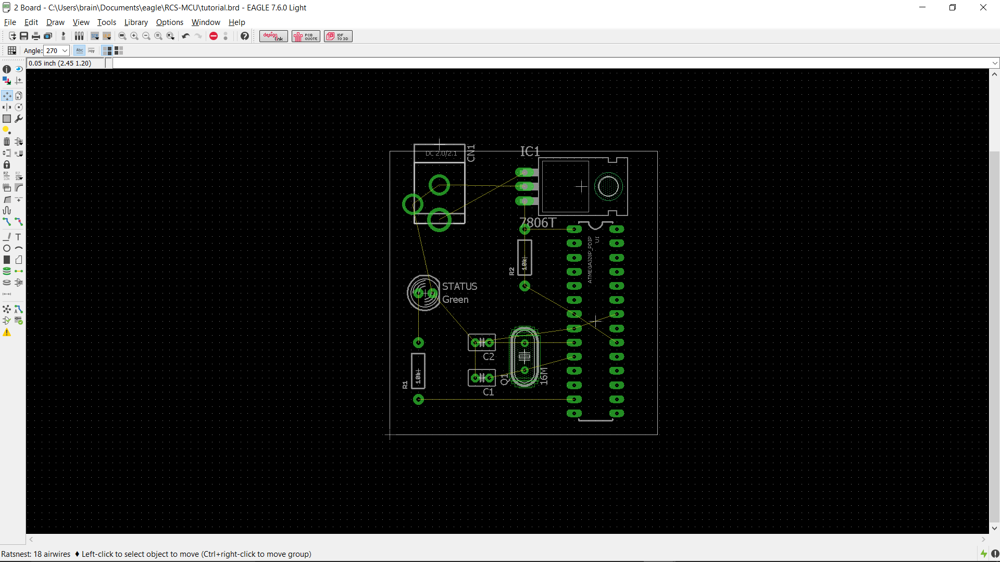

Now its time to begin routing manually. Manual routing is a good idea for small boards, but can take a long time for larger board with more components on them. In these cases it can be best to use autoroute to completely or partially route your board. Sometimes you may find that your design is extremely difficult or impossible to route in its current form. This is okay, making a PCB is an iterative process, and laying out a complex PCB can take several tries before it can be routed.

Here is our routed PCB. Notice how traces are on both the top (red) and bottom (blue) layers. Using both layers can help save space or make routing easier. Since all of the parts we used are through hole, each trace can connect to the pads on either the top or bottom layer. SMD parts can be placed on either the top or bottom sides of the PCB, but traces can only connect to these parts on the side they are placed.

Since we are done with our routing, we run the DRC to check for errors.

It turns out the drill size we chose for our via is too small!

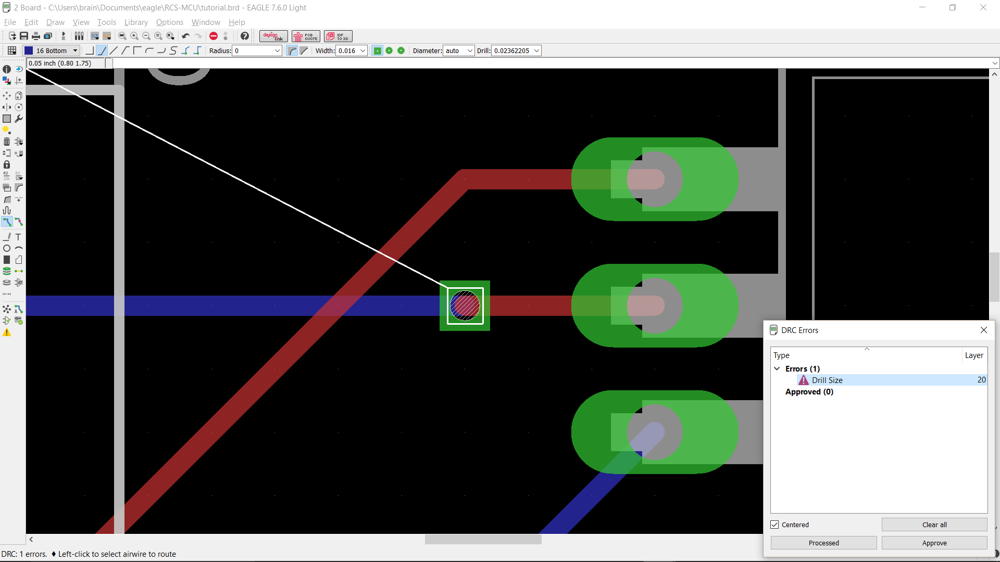

To fix this problem, we increase the drill size for the via and process the error.

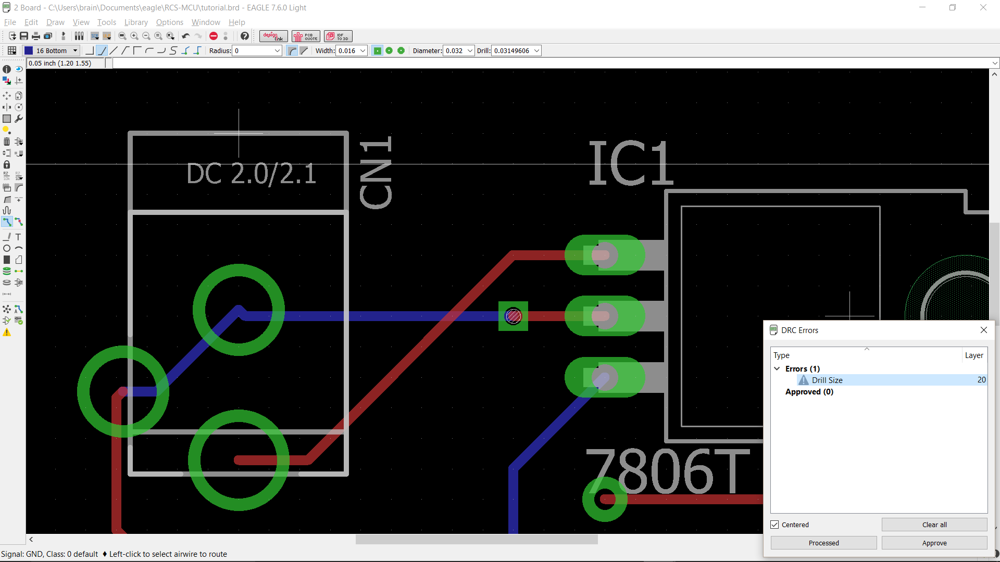

We run DRC on the board again and find no errors. This means that are PCB is ready to be sent to a PCB fabricator!

