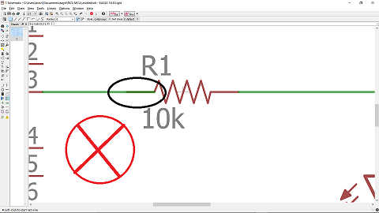
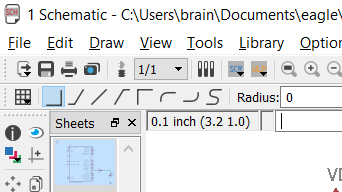
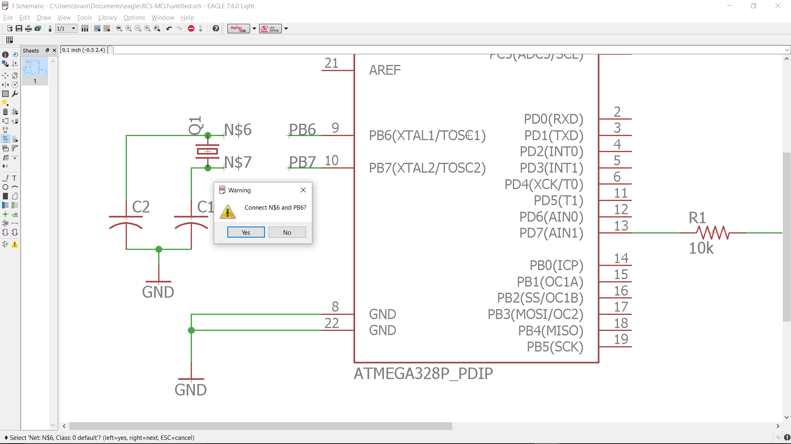
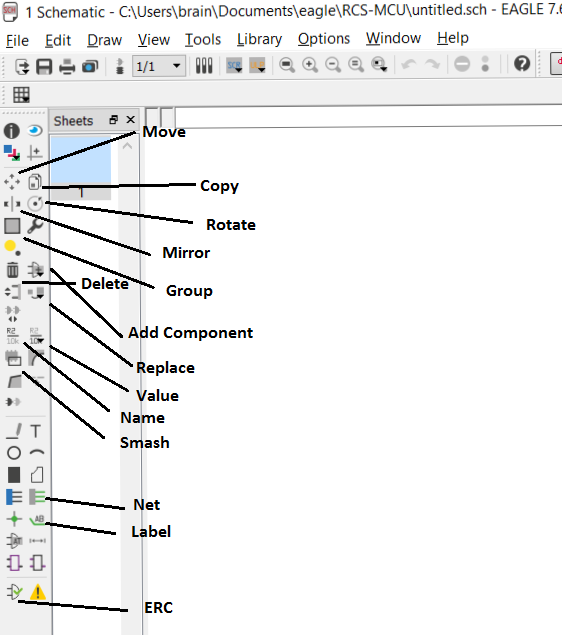

# Eagle Tutorial
## Uses for Eagle
Eagle is a software program used for making electrical schematics and designing PCBs.

## Choosing Components
One of the most crucial steps in designing a PCB is choosing exactly what kind of components you will use. It is typically best to make these decisions while laying out the schematic. As Eagle has a large library of parts, this section will help you make better decisions on what kind of parts to use.
### Through hole vs. SMD
Most common circuit components, such as resistors, capacitors, fuses, and some chips, come in two packages, SMD and through hole. You should try and look up what packages the parts you want are offered in, as some parts are only offered in one package. An example of this would be large capacity capacitors being only offered in through hole packages due to their large physical size. In the case a part is offered in both SMD and through hole, there is a description of each type below.
#### SMD
SMD stands for Surface Mount Device. This type of part is designed to be soldered directly onto the surface of a PCB. Typical SMD components are offered in many different sizes, indicated by a 4 digit number in the package name. The larger the number, the larger the size of the device. For hand soldering, it is unadvisable to use any SMD parts smaller than 0805, as very small SMD parts can be prohibitively difficult to solder. The primary advantages of SMD parts are their small size and cheap price. The drawback of these parts is the fact that they can be difficult to solder and can only be used with PCBs, not breadboard or solderboards.
#### Through hole
Through hole parts typically have long leads meant to go into the holes of a breadboard or solderboard. These parts have a lot of variation in their footprints, so make the dimensions of the footprint of the part in your schematic match the dimensions listed on the part's datasheet. The advantage of through hole parts are that they are very common in the lab, can be used on PCBs, breadboards, and solderboards, and they are easier to solder. Their disadvantages are that they are typically very large compared to SMD parts.
### Different chip packages
Sometimes a chip will be offered in several different packages. Make sure to choose a package for the chip that best suits your needs. Different packages for the same chip often have different pin mappings, so be aware of this. As with regular components, SMD chips are smaller but much more difficult to solder than DIP (Dual Inline Package) chips.
### Adding more parts to the eagle library
## Creating a Schematic
To open a schematic in Eagle, simply click on new schematic under the files button on the control panel. This gives you a blank canvas on for you to place your components. It is best to place all of your components and arrange them before you start wiring, as wiring makes moving parts around difficult.

### Placing Components
To place a component, click on the add component button on the left side of the screen. This will bring up a window that lists all the available components. It is often fastest to use the search feature to look for the part you would like, then picking from the results. If you are having trouble looking up a part, add asterisks before and after the part name. These function as "wildcard" characters and will give you more results. If you are just designing a schematic, then the only thing you need to pay attention to is the part's symbol. If you intend to make a PCB of your design, then you also have to pay attention to the package options for each part, as this is how the part will be mounted to your PCB. It helps to have already researched all your parts and selected their packages beforehand. The Digikey and Adafruit libraries have footprints for most common electrical components and chips. Sometimes Eagle just doesn't have the part you are looking for, and you will have to download an Eagle library or add the part to manually to Eagle's list of parts.

### Wiring
Wiring is how you connect parts together in Eagle. This is done with the net tool. The simplest way to connect two parts is to simply draw a net between their leads. If you right click on the net and click show, the net and the leads of each part should be highlighted, indicating they are connected. Be careful not to let nets overlap with the part's symbol, as this does not make a connection between parts.

Right clicking with the net tool allows you to change the way the net is drawn between two points. This can also be done with the by clicking on a drawing style in the top left corner of the screen. In schematics you typically want to keep all the nets at right angles.

A more indirect way to connect two parts is to draw a small segment on each part's lead and giving each net segment the same name. This will connect the nets, and by extension, the parts. When doing this, it helps to use the label tool to label the name of each net, making it easier to see what each part is connected to. A step by step processes is show below

1. Label the nets you want to connect, and rename one with the name you want to give all the connected nets

2. Rename the other nets you want to connect with the name you gave the first net

3. Select ok when asked if you want to connect the nets

4. Right click on one of the nets and select show to verify that the nets have been connected

### Groups
If you want to move manipulate multiple parts at once, then you should use the group tool. Once you select the group tool, drag a box over or ctrl+click the parts you want to select. After you have selected all the parts you want, select the tool you want to use on the group, such as move, copy or delete. Then right click on empty space and select "Tool:Group," where "Tool" is the tool you selcted in the previous step, such as move or copy.
### Useful Tools

#### Move
Used to move parts around. To move a part, select move, then select the part, then click where you want to move the part to.
#### Name
This tool allows you to change the name of a part. This is great for increasing your schematic's readablity, since you are able to rename LED0 to POWER_LED or ERROR_LED. This also changes the silkscreen on the PCB so you will still be able to
#### Value
The value tool allows you to change the value of a part. Many parts in Eagle don't explicitly tell you what their value is, so you have to set it with the value tool. Be sure to give every resistor, capacitor, and inductor a value, such as 10k for a 10k&Omega; resistor.
#### Label
The label tool allows you to attach labels to your nets. It is wise to label all of your imporant nets, as well as any nets that are not directly connected.
#### Copy
Allows you to copy and paste parts. Click on the part you want to copy, then click wherever you want to place to copy.
#### Replace
Allows you to replace components. This is useful when you want to change the package/footprint for a part. Select the component you want to place in, then click on all the parts you want replaced.
#### Smash
This separates the value, name, and symbol of a component. This is most useful in cluttered schematics, as it allows you to adjust the names and values of components so that they do not overlap and are readable. To smash a part, click on the smash tool, then click on the part you want to smash.
#### Mirror
Mirrors an object about its y axis. To mirrior an object, select mirror and click on the object
#### Rotate
Rotates an object about its midpoint. Different options for rotation are presented in the top left corner of the screen. To rotate an object, select rotate and click on it.
### ERC Check
Once you have completed you schematic, it is wise to run an ERC check, which checks for any errors in the schematic. If you click on an error, Eagle will highlight where the error is on the schematic and allow you to process, approve or clear the errors. Processing an error means that you have corrected the error, but still want to check for it on future ERC checks. Approving an error means the error isn't an error at all, and removes the error from appearing on any future ERC checks. Clearing the errors is the same thing as processing them, except all the errors are removed from the current list, but will still appear on future ERC checks if they have not been corrected. Be aware that this check is not completely comprehensive, so you should still check over your schematic carefully even if it does pass ERC.

## Creating a Board
## Example Schematic and Board Creation
### Schematic
## Adding More Parts
