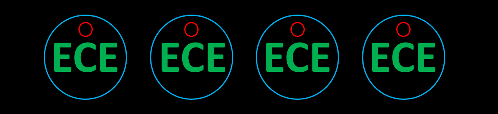
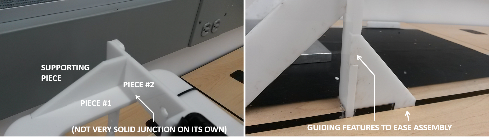

# ECE3400 Fall 2017

## Tips for designing parts for a Laser Cutter

*By Kirstin Petersen (khp37) August 9th, 2017*

### Drawing Layout

To cut a piece of material in the laser cutter you will need to make a 2D drawing, for example in [AutoCad](./AutoCAD_Tutorial.md). Zero thickness lines (hairlines) will be cut, whereas thicker lines will be rastered onto the material. The latter technique is usually used to make drawings and engravings on a sheet. 

It often makes sense to make the size of the sheet that you are drawing on fit the size of the laser cutter (1x2 feet). That way you can easily get an idea of where things will be cut. Also, be sure to print at a 100% scale if you print to pdf instead of dxl files.

You can set different properties for different colors. For example, you can make the engraving in green, any internal holes in red, and any outline in blue. You can then adjust the settings for each color appropriately, and first raster all the green color, then cut all the red lines, and then cut the blue lines. When the full circumference of a piece has been cut it tends to shift, therefore it is wise to cut the outline after any internal holes so that they don't shift relative to each other. 

### Part Design

#### Tolerance
First rule of laser cutters, is that they literally burn away material. The width of the beam is related to the amount of power you dissipate in the material, so it is always desirable to run the cutter at the lowest possible power. The focus of the beam determines how scattered your beam is when it reaches the material, typically people use Autofocus which means that the beam is focused either near the surface of the material or near the center. Either way the cut will bevels slightly outwards from the focus point. Be sure to incorporate these tolerances into your design!

#### Making 3D parts
If your part can be composed by many sheets of material (instead of curved surfaces), these can still be made in a laser cutter. There are several tips to help you design such parts:

* Connections can be made with nuts and bolts. These connections are reversible; however, if you are using acrylic sheets, these are brittle and can easily crack if too much tension is applied. It is also not possible to cut threads in acrylic.

* Connections can be made with pressfits. Such connections are great, because they are reversible and does not require added materials. However, it can be hard to get the dimensions right, because the of the tolerances mentioned above. Also, this method will not work with brittle materials like acrylic. It is a very viable option for wood or cardboard however.

* Connections can also be made using glue. Acrylic sheets can be welded together using Weld-On. To do this apply the glue to both pieces, let it sit for ~10-20seconds, then press the pieces together tightly for 1-2 minutes to form an unbreakable connection. Obviously these connections work best when the surface area between the two parts is large. Be sure to use gloves when you work with Weld-On as it is carcinogenic. Gorilla Glue works well for wood, and Elmers glue or instant glue works fine for cardboard.

* A 90 degree connection between sheets does not leave a lot of surface area for bonding, instead a third piece is often used to help stabilize the connection. 

* It can be very hard to accurate align your pieces in the few seconds you have while the glue is setting. It is therefore very helpful to include guiding features into all of your pieces ensuring that they are locked into place. 

