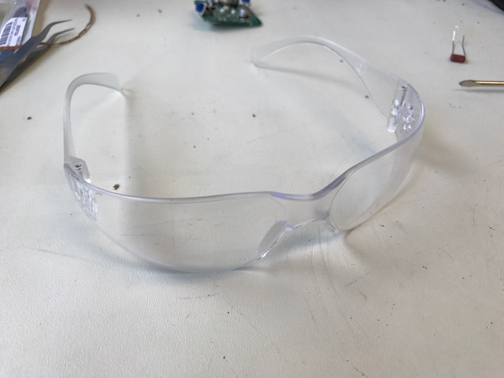
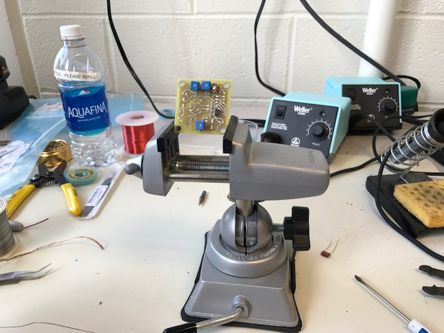
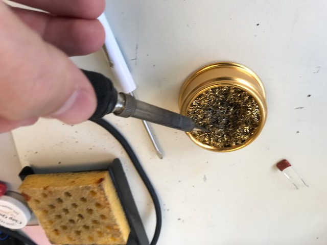
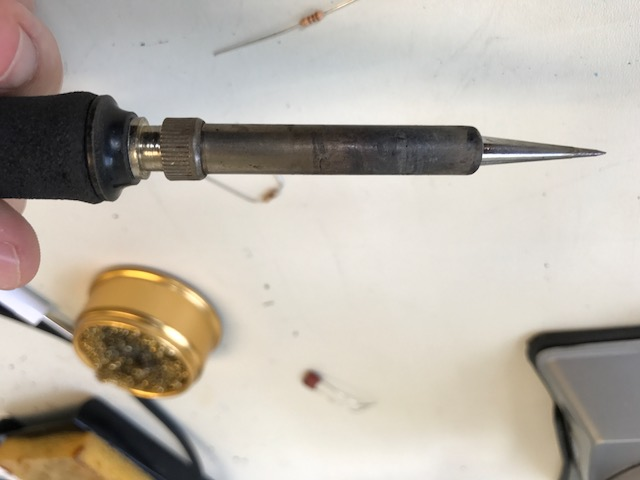
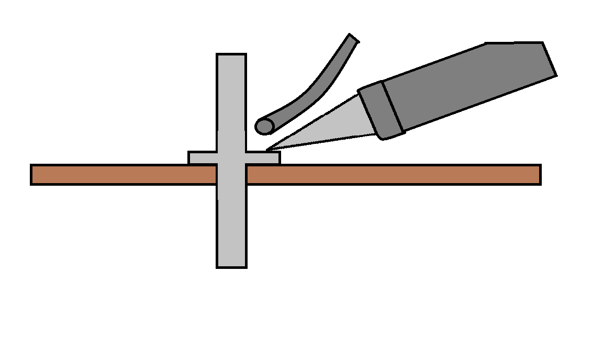
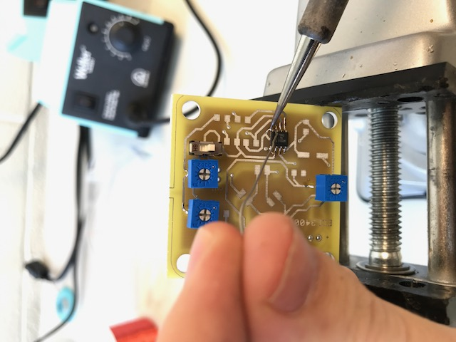

# Soldering Tutorial
## Soldering Safety
### 1. Always wear safety goggles while soldering
This is important, as solder sometimes has a tendency to spurt, sending small droplets of molten solder into the air. Since the droplets are small, they do not generally cause damage to the skin or clothes, but have the potential to cause serious damage to unprotected eyes.

### 2. Be careful with the soldering iron
The tip of the soldering iron can get as hot as 700 degrees during use, which can cause serious burns to skin and melt most plastics. This means that caution must be observed when handling the iron. If you have long hair, tie it behind your head. Don't wear loose jewelry and roll up long sleeves when soldering.

### 3. Do not touch wires/parts that are being soldered
Metal objects like wires and resistor leads conduct heat very well, and may be heated several hundred degrees by the soldering iron, which can lead to severe burns.

### 4. Wash your hands after soldering!
Always wash your hands after finishing in the lab. Remember that eating is never permitted in the lab; neither are open drinking cups.

## Four Easy Steps to Soldering
### 1. Secure the joint that needs to be soldered
Ensure that the parts or wires that need to be soldered are held securely in place. Devices like clamps, vices, or tape can help with this. Ensure that nothing sensitive to heat is touching the area that is going to be soldered.

### 2. Get the iron ready
Turn on the iron and set the temperature to 700&deg;F (370&deg;C), and give it around a minute to warm up. Next clean the tip of the iron by wiping it on a wet sponge. If the tip is very dirty you can also wipe it on a metal sponge, and use tinner to improve the heat conduction again. A shiny iron leads heat well, a matte iron does not conduct heat very well and will be harder to use.

### 3. Solder the connection
Hold a strand of solder in one hand and the soldering iron in the other. Place the iron on the joint you want to solder and feed the solder onto the joint. The solder should melt as it touches the iron/joint. Apply enough solder so that the connection is mechanically and electrically stable. Applying too much solder can make a connection difficult to desolder, so be careful not to use too much.

### 4. Evaluate
A good solder joint should be shiny and cone shaped. If the joint is dull, it is the result of "cold solder," which occurs when molten solder is added to the joint, instead of being melted onto the joint itself. If the joint is blob shaped, that might mean that the solder spread to other connections, so be sure to check for shorts.
-Add photos!!-
# Desoldering Tutorial
## Safety
### 1. The same safety rules for soldering apply to desoldering
Always wear safety goggles/glasses, be careful with the iron, and don't touch anything while it is being desoldered
### 2. Do not touch the braid while desoldering
Since braid is made of finely woven copper, it conducts heat very well. This means that when the braid touches the iron, it heats up very quickly and will burn your hands if you are holding on to it.
## Four Easy Steps to Desoldering Using Braid
### 1. Secure the joint that needs to be desoldered
Ensure that the parts or wires that need to be desoldered are held securely in place. Devices like clamps, vices, or tape can help with this. Ensure that nothing sensitive to heat is touching the area that is going to be desoldered.
### 2. Get the iron ready
Turn on the iron and set the temperature to 700&deg;F (370&deg;C), and give it around a minute to warm up. Next clean the tip of the iron by wiping it on a wet sponge.
### 3. Desolder the connection
Get a clean strand of braid to desolder with. Pick up a strand of braid with a pair of metal tweezers in one hand and pick up the soldering iron with the other. Use the tweezers to press the braid onto the area to be desoldered, then apply the soldering iron onto the braid. After a short amount of time, the solder should melt and be absorbed by the braid. Be careful not to keep the iron on the connection too long, as you run the risk of burning the parts/board you are trying to desolder. Excessive heating may also cause the traces to delaminate from the PCB. It is often best to wait a couple minutes between desoldering attempts to give the parts and board a chance to cool down.
-Add Photos!-
### 4. Evaluate
How much solder is still left on the joint? Sometimes multiple attempts need to be made to get all the solder off of a connection. Sometimes it helps to add more solder to a joint you are trying to desolder. Also check that while desoldering, you did not inadvertently solder or desolder other connections on the board.

To do (from Kirstin):
- Add photo of safety tips
- Add photo of dirty iron
- Add photo of good solder joint vs bad solder joint
- Add photo of how to use the braid.
- Add photo of poor removal(?)
- Add one specific to chips. Add one specific to wires.
- Explain what iron tip to use for what. And how to change it.
- Explain what size solder to use for what, and what type of wire to use for what.
- Add tutorial on

# Good Luck and Happy Soldering!
