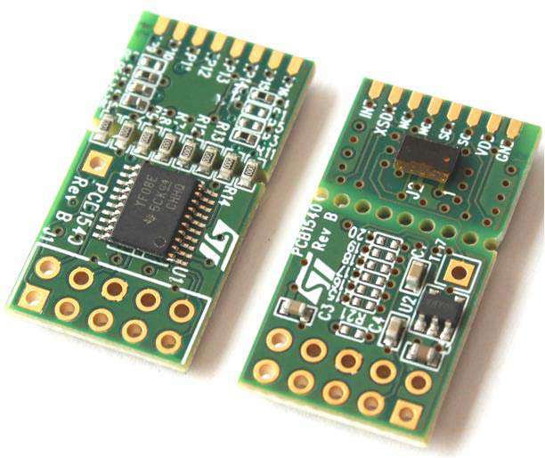
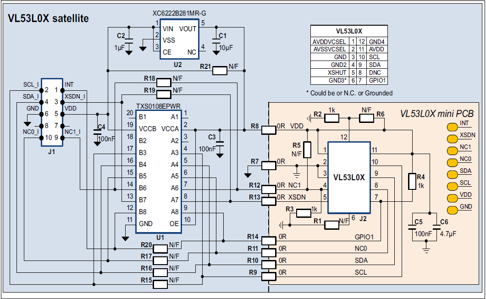
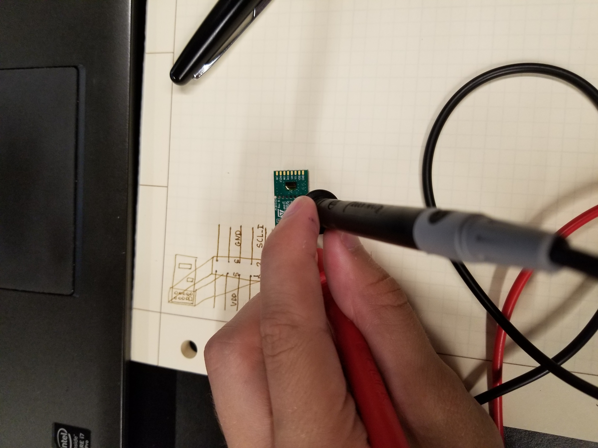
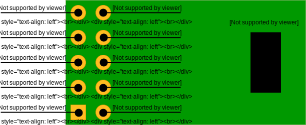
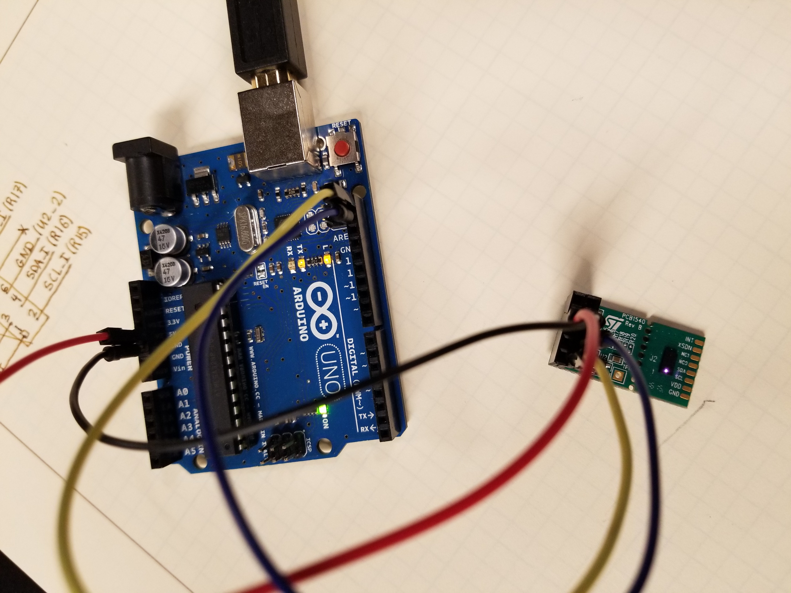
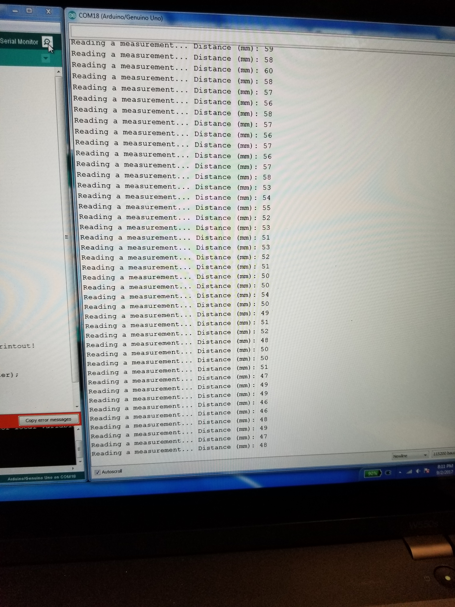

# ECE3400 Fall 2017
## How to use the VL53L0X Time-of-Flight Distance Sensor

*By Peter Slater, September 4th, 2017*

The goal of this tutorial is to get the [ST VL53L0X](http://www.st.com/en/imaging-and-photonics-solutions/vl53l0x.html) time of flight (TOF) ranging sensor working with the Arduino Uno. This document assumes that the reader is familiar with programming an Arduino and installing a 3rd party Arduino library.

#### Procedure

Figure 1: Top and bottom view of the board used for the VL53L0X evaluation. Note the J1 header on the bottom of the image with the square and cross-hair pads. ([Source](http://www.st.com/content/ccc/resource/technical/document/data_brief/group0/e2/8a/a0/9c/a7/cc/41/f3/DM00286872/files/DM00286872.pdf/jcr:content/translations/en.DM00286872.pdf))

Figure 2: Schematic for the evaluation board. Note the J1 header on the left of the image. ([Source](http://www.st.com/content/ccc/resource/technical/document/data_brief/group0/e2/8a/a0/9c/a7/cc/41/f3/DM00286872/files/DM00286872.pdf/jcr:content/translations/en.DM00286872.pdf))

The board we are evaluating is the [ST 53L0-SATEL-I1](http://www.st.com/content/ccc/resource/technical/document/data_brief/group0/e2/8a/a0/9c/a7/cc/41/f3/DM00286872/files/DM00286872.pdf/jcr:content/translations/en.DM00286872.pdf) shown in Figure 1. It contains the VL53L0X and the required support electronics. The support electronics are needed because the VL53L0X uses 2.8V power and logic but the Arduino uses 5V, the board will also work with 3.3V. The first step was to find the pinout for the board. The only schematic given (Figure 2) indicates that the required pins are on the J1 header, but sadly the board has no indication which orientation the header is placed. This means that we have to reverse engineer the pinout.

##### Reverse Engineering the Pinout

Figure 3: Using a multimeter to reverse engineer the pinout.

The first pin that stands out is the only one with a rectangular pad. Typically this is used to indicate pin 1 of the header. The next pin to be found is the ground pin. If you look closely in Figure 2, you can see that the inside center pin has a cross-hair pattern connecting it to the fill plane. Almost always the fill plane is always the ground trace and the pattern is used to thermally isolate the pad to make it easier to solder. To confirm these findings, we use a multimeter to test the connections on the header with known connections, mainly the resistors R15-R20 and the voltage regulator U2. Our assumptions are correct and we find the correct pin mapping summarized in Figure 4.

Figure 4: The pinout determined for the VL53L0X satellite board. View is looking down on the VL53L0X as indicated.

##### Wiring the Board

Figure 5: Picture of the final circuit. The connections made from the Arduino to the J1 header are: 5V to VDD (Red), GND to GND (Black), SCL to SCL_I (Yellow), SDA to SDA_I (Blue). Note the purple glow of the operating Vl53L0X.

The microcontroller used to control the Vl53L0X is the Arduino Uno. Since the sensor uses an I2C interface for communication four wires are required: 5V, GND, SDA, and SCL. These connections were made using jumper wire and the assembled circuit is shown in Figure 5.

##### Sensor Testing

The next step is to get code to command the sensor and read back the distance reading. Luckily the sensor is popular and an [Arduino library](https://github.com/adafruit/Adafruit_VL53L0X) by Adafruit already exists. After the library was downloaded and installed, the provided example program can be used to test the sensor. Its output is shown in Figure 6.

Figure 6: Serial output from the provided example code.

##### Conclusion

The most difficult part of this sequence was deciphering the pinout used for the sensor. After that initial hurdle, there were no other major problems. The sensor seems to provide readings accurate within its specification of around 5%, which is shown in the constant variation of the sensor readings. This is shown in the last few lines of Figure 6 as the target was fixed but the distance keeps changing. To improve the accuracy the sensor can be put in a high accuracy mode but that ultimately reduces the sample rate which is a possibility for future exploration.

#### Helpful Links

[VL53L0X Datasheet](http://www.st.com/content/ccc/resource/technical/document/datasheet/group3/b2/1e/33/77/c6/92/47/6b/DM00279086/files/DM00279086.pdf/jcr:content/translations/en.DM00279086.pdf)

[VL53L0X Satellite Board Datasheet](http://www.st.com/content/ccc/resource/technical/document/data_brief/group0/e2/8a/a0/9c/a7/cc/41/f3/DM00286872/files/DM00286872.pdf/jcr:content/translations/en.DM00286872.pdf)

[Adafruit VL53L0X Tutorial](https://learn.adafruit.com/adafruit-vl53l0x-micro-lidar-distance-sensor-breakout/overview)

[Adafruit VL53L0X Arduino Library](https://github.com/adafruit/Adafruit_VL53L0X)
